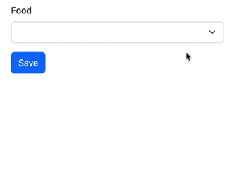
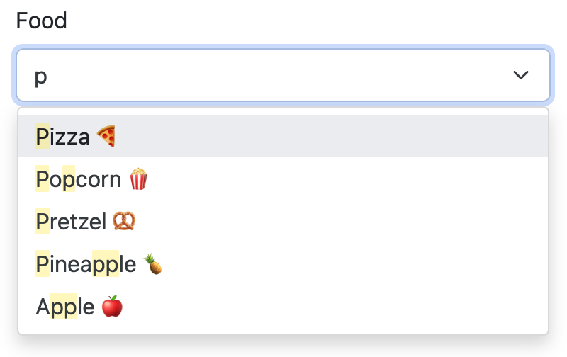

Autocomplete <select>
=====================

Transform your ``EntityType``, ``ChoiceType`` or *any* ``<select>`` element
into an Ajax-powered autocomplete smart UI control (leveraging `Tom Select`_):

Installation
------------

.. caution::

    Before you start, make sure you have `StimulusBundle configured in your app`_.

Install the bundle using Composer and Symfony Flex:

.. code-block:: terminal

    $ composer require symfony/ux-autocomplete

If you're using WebpackEncore, install your assets and restart Encore (not
needed if you're using AssetMapper):

.. code-block:: terminal

    $ npm install --force
    $ npm run watch

Usage in a Form (without Ajax)
------------------------------

Any ``ChoiceType`` or ``EntityType`` can be transformed into a
Tom Select-powered UI control by adding the ``autocomplete`` option:

.. code-block:: diff

    // src/Form/AnyForm.php
    // ...

    class AnyForm extends AbstractType
    {
        public function buildForm(FormBuilderInterface $builder, array $options): void
        {
            $builder
                ->add('food', EntityType::class, [
                    'class' => Food::class,
                    'placeholder' => 'What should we eat?',
    +                'autocomplete' => true,
                ])

                ->add('portionSize', ChoiceType::class, [
                    'choices' => [
                        'Choose a portion size' => '',
                        'small' => 's',
                        'medium' => 'm',
                        'large' => 'l',
                        'extra large' => 'xl',
                        'all you can eat' => '∞',
                    ],
    +                'autocomplete' => true,
                ])
            ;
        }
    }

That's all you need! When you refresh, the Autocomplete Stimulus controller
will transform your select element into a smart UI control:

Usage in a Form (with Ajax)
---------------------------

In the previous example, the autocomplete happens "locally":
all of the options are loaded onto the page and used for the
search.

If you're using an ``EntityType`` with *many* possible options,
a better option is to load the choices via AJAX. This also allows
you to search on more fields than just the "displayed" text.

To transform your field into an Ajax-powered autocomplete, you need
to create a new "form type" class to represent your field. If you
have MakerBundle installed, you can run:

.. code-block:: terminal

    $ php bin/console make:autocomplete-field

Or, create the field by hand::

    // src/Form/FoodAutocompleteField.php
    // ...

    use Symfony\Bundle\SecurityBundle\Security;
    use Symfony\UX\Autocomplete\Form\AsEntityAutocompleteField;
    use Symfony\UX\Autocomplete\Form\BaseEntityAutocompleteType;

    #[AsEntityAutocompleteField]
    class FoodAutocompleteField extends AbstractType
    {
        public function configureOptions(OptionsResolver $resolver)
        {
            $resolver->setDefaults([
                'class' => Food::class,
                'placeholder' => 'What should we eat?',

                // choose which fields to use in the search
                // if not passed, *all* fields are used
                //'searchable_fields' => ['name'],

                // if the autocomplete endpoint needs to be secured
                //'security' => 'ROLE_FOOD_ADMIN',

                // ... any other normal EntityType options
                // e.g. query_builder, choice_label
            ]);
        }

        public function getParent(): string
        {
            return BaseEntityAutocompleteType::class;
        }
    }

.. versionadded:: 2.13

    ``BaseEntityAutocompleteType`` is a new replacement for ``ParentEntityAutocompleteType``.

There are 3 important things:

#. The class needs the ``#[AsEntityAutocompleteField]`` attribute so that
   it's noticed by the autocomplete system.
#. The ``getParent()`` method must return ``BaseEntityAutocompleteType``.
#. Inside ``configureOptions()``, you can configure your field using whatever
   normal ``EntityType`` options you need plus a few extra options (see `Form Options Reference`_).

After creating this class, use it in your form:

.. code-block:: diff

    // src/Form/AnyForm.php
    // ...

    class AnyForm extends AbstractType
    {
        public function buildForm(FormBuilderInterface $builder, array $options): void
        {
            $builder
    +            ->add('food', FoodAutocompleteField::class)
            ;
        }
    }

.. caution::

    Avoid passing any options to the 3rd argument of the ``->add()`` method as
    these won't be used during the Ajax call to fetch results. Instead, include
    all options inside the custom class (``FoodAutocompleteField``) or pass them as
    :ref:`extra options <passing-extra-options-to-the-ajax-powered-autocomplete>`.

Congratulations! Your ``EntityType`` is now Ajax-powered!

Styling Tom Select
------------------

In your ``assets/controllers.json`` file, you should see a line that automatically
includes a CSS file for Tom Select which will give you basic styles.

If you're using Bootstrap, set ``tom-select.default.css`` to false
and ``tom-select.bootstrap5.css`` to true:

.. code-block:: text

    "autoimport": {
        "tom-select/dist/css/tom-select.default.css": false,
        "tom-select/dist/css/tom-select.bootstrap5.css": true
    }

To further customize things, you can override the classes with your own custom
CSS and even control how individual parts of Tom Select render. See `Tom Select Render Templates`_.

Form Options Reference
----------------------

All ``ChoiceType``, ``EntityType`` and ``TextType`` fields have the following new
options (these can also be used inside your custom Ajax autocomplete classes,
e.g. ``FoodAutocompleteField`` from above):

``autocomplete`` (default: ``false``)
    Set to ``true`` to activate the Stimulus plugin on your ``select`` element.

``tom_select_options`` (default: ``[]``)
    Use this to set custom `Tom Select Options`_. If you need to set
    an option using JavaScript, see `Extending Tom Select`_.

``options_as_html`` (default: ``false``)
    Set to ``true`` if your options (e.g. ``choice_label``) contain HTML. Not
    needed if your autocomplete is AJAX-powered.

``autocomplete_url`` (default: ``null``)
    Usually you don't need to set this manually. But, you *could* manually create
    an autocomplete-Ajax endpoint (e.g. for a custom ``ChoiceType``), then set this
    to change the field into an AJAX-powered select.

``loading_more_text`` (default: 'Loading more results...')
    Rendered at the bottom of the list while fetching more results. This message is
    automatically translated using the ``AutocompleteBundle`` domain.

``no_results_found_text`` (default: 'No results found')
    Rendered when no matching results are found. This message is automatically translated
    using the ``AutocompleteBundle`` domain.

``no_more_results_text`` (default: 'No more results')
    Rendered at the bottom of the list after showing matching results. This message
    is automatically translated using the ``AutocompleteBundle`` domain.

For the Ajax-powered autocomplete field classes (i.e. those whose
``getParent()`` returns ``BaseEntityAutocompleteType``), in addition
to the options above, you can also pass:

``searchable_fields`` (default: ``null``)
    Set this to an array of the fields on your entity that should be used when
    searching for matching options. By default (i.e. ``null``), *all* fields on your
    entity will be searched. Relationship fields can also be used - e.g. ``category.name``
    if your entity has a ``category`` relation property.

``security`` (default: ``false``)
    Secures the Ajax endpoint. By default, the endpoint can be accessed by
    any user. To secure it, pass ``security`` to a string role (e.g. ``ROLE_FOOD_ADMIN``)
    that should be required to access the endpoint. Or, pass a callback and
    return ``true`` to grant access or ``false`` to deny access::

        use Symfony\Bundle\SecurityBundle\Security;

        [
            'security' => function(Security $security): bool {
                return $security->isGranted('ROLE_FOO');
            },
        ];

``filter_query`` (default: ``null``)
    If you want to completely control the query made for the "search results",
    use this option. This is incompatible with ``searchable_fields``::

        [
            'filter_query' => function(QueryBuilder $qb, string $query, EntityRepository $repository) {
                if (!$query) {
                    return;
                }

                $qb->andWhere('entity.name LIKE :filter OR entity.description LIKE :filter')
                    ->setParameter('filter', '%'.$query.'%');
            },
        ];

``max_results`` (default: 10)
    Allow you to control the max number of results returned by the automatic autocomplete endpoint.

``min_characters`` (default: 3)
    Allow you to control the min number of characters to load results.

``preload`` (default: ``focus``)
    Set to ``focus`` to call the ``load`` function when control receives focus.
    Set to ``true`` to call the ``load`` upon control initialization (with an empty search).

``extra_options`` (default ``[]``)
    Allow you to pass extra options for Ajax-based autocomplete fields.

.. _passing-extra-options-to-the-ajax-powered-autocomplete:

Passing Extra Options to the Ajax-powered Autocomplete
~~~~~~~~~~~~~~~~~~~~~~~~~~~~~~~~~~~~~~~~~~~~~~~~~~~~~~

.. versionadded:: 2.14

    The ability to pass extra options was added in Autocomplete 2.14.

Autocomplete field options are not preserved when the field is rendered on an Ajax call. So, features like exclude some options
based on the current form data are not possible by default. To partially avoid this limitation, the `extra_options` option was added.

.. warning::

    Only scalar values (``string``, ``integer``, ``float``, ``boolean``), ``null`` and ``array`` (consisted from the same types as mentioned before) can be passed as extra options.

Considering the following example, when the form type is rendered for the first time, it will use the ``query_builder`` defined
while adding a ``food`` field to the ``FoodForm``. However, when the Ajax is used to fetch the results, on the consequent renders,
the default ``query_builder`` will be used::

    // src/Form/FoodForm.php
    // ...

    class FoodForm extends AbstractType
    {
        public function buildForm(FormBuilderInterface $builder, array $options): void
        {
            $currentFoodId = $builder->getData()->getId();

            $builder
                ->add('food', FoodAutocompleteField::class, [
                    'query_builder' => function (EntityRepository $er) {
                            $qb = $er->createQueryBuilder('o');

                            $qb->andWhere($qb->expr()->notIn('o.id', [$currentFoodId]));

                            return $qb;
                        };
                    }
                ])
            ;
        }
    }

If some food can be consisted of other foods, we might want to exclude the "root" food from the list of available foods.
To achieve this, we can remove the ``query_builder`` option from the above example and pass the ``excluded_foods`` extra option
to the ``FoodAutocompleteField``::

    // src/Form/FoodForm.php
    // ...

    class FoodForm extends AbstractType
    {
        public function buildForm(FormBuilderInterface $builder, array $options): void
        {
            $currentFoodId = $builder->getData()->getId();

            $builder
                ->add('food', FoodAutocompleteField::class, [
                    'extra_options' => [
                        'excluded_foods' => [$currentFoodId],
                    ],
                )
            ;
        }
    }

The magic of the ``extra_options`` is that it will be passed to the ``FoodAutocompleteField`` every time an Ajax call is made.
So now, we can just use the ``excluded_foods`` extra option in the default ``query_builder`` of the ``FoodAutocompleteField``::

    // src/Form/FoodAutocompleteField.php
    // ...

    use Symfony\Bundle\SecurityBundle\Security;
    use Symfony\UX\Autocomplete\Form\AsEntityAutocompleteField;
    use Symfony\UX\Autocomplete\Form\BaseEntityAutocompleteType;

    #[AsEntityAutocompleteField]
    class FoodAutocompleteField extends AbstractType
    {
        public function configureOptions(OptionsResolver $resolver): void
        {
            $resolver->setDefaults([
                // ...
                'query_builder' => function (Options $options) {
                    return function (EntityRepository $er) use ($options) {
                        $qb = $er->createQueryBuilder('o');

                        $excludedFoods = $options['extra_options']['excluded_foods'] ?? [];
                        if ([] !== $excludedFoods) {
                            $qb->andWhere($qb->expr()->notIn('o.id', $excludedFoods));
                        }

                        return $qb;
                    };
                }
            ]);
        }

        public function getParent(): string
        {
            return BaseEntityAutocompleteType::class;
        }
    }

Using with a TextType Field
---------------------------

All of the above options can also be used with a ``TextType`` field::

    $builder
        // ...
        ->add('tags', TextType::class, [
            'autocomplete' => true,
            'tom_select_options' => [
                'create' => true,
                'createOnBlur' => true,
                'delimiter' => ',',
            ],
            // 'autocomplete_url' => '... optional: custom endpoint, see below',
        ])
    ;

This ``<input>`` field won't have any autocomplete, but it *will* allow the
user to enter new options and see them as nice "items" in the box. On submit,
all of the options - separated by the ``delimiter`` - will be sent as a string.

You *can* add autocompletion to this via the ``autocomplete_url`` option - but you'll
likely need to create your own :ref:`custom autocomplete endpoint <custom-autocomplete-endpoint>`.

Customizing the AJAX URL/Route
------------------------------

.. versionadded:: 2.7

    The ability to specify the route was added in Twig Components 2.7.

The default route for the Ajax calls used by the Autocomplete component is ``/autocomplete/{alias}/``.
Sometimes it may be useful to customize this URL - e.g. so that the URL lives
under a specific firewall.

To use another route, first declare it:

.. code-block:: yaml

    # config/routes/attributes.yaml
    ux_entity_autocomplete_admin:
        controller: ux.autocomplete.entity_autocomplete_controller
        path: '/admin/autocomplete/{alias}'

Then specify this new route on the attribute::

    // src/Form/FoodAutocompleteField.php
    #[AsEntityAutocompleteField(route: 'ux_entity_autocomplete_admin')]
    class FoodAutocompleteField
    {
        // ...
    }

Extending Tom Select
--------------------

The easiest way to customize `Tom Select`_ is via the ``tom_select_options``
option that you pass to your field. This works great for simple
things like Tom Select's ``loadingClass`` option, which is set to a string.
But other options, like ``onInitialize``, must be set via JavaScript.

To do this, create a custom Stimulus controller and listen to one or both
events that the core Stimulus controller dispatches:

.. code-block:: javascript

    // assets/controllers/custom-autocomplete_controller.js
    import { Controller } from '@hotwired/stimulus';

    export default class extends Controller {
        initialize() {
            this._onPreConnect = this._onPreConnect.bind(this);
            this._onConnect = this._onConnect.bind(this);
        }

        connect() {
            this.element.addEventListener('autocomplete:pre-connect', this._onPreConnect);
            this.element.addEventListener('autocomplete:connect', this._onConnect);
        }

        disconnect() {
            // You should always remove listeners when the controller is disconnected to avoid side-effects
            this.element.removeEventListener('autocomplete:connect', this._onConnect);
            this.element.removeEventListener('autocomplete:pre-connect', this._onPreConnect);
        }

        _onPreConnect(event) {
            // TomSelect has not been initialized - options can be changed
            console.log(event.detail.options); // Options that will be used to initialize TomSelect
            event.detail.options.onChange = (value) => {
                // ...
            };
        }

        _onConnect(event) {
            // TomSelect has just been initialized and you can access details from the event
            console.log(event.detail.tomSelect); // TomSelect instance
            console.log(event.detail.options); // Options used to initialize TomSelect
        }
    }

.. note::

    The extending controller should be loaded eagerly (remove ``/* stimulusFetch: 'lazy' */``), so
    it can listen to events dispatched by the original controller.

Then, update your field configuration to use your new controller (it will be used
in addition to the core Autocomplete controller):

.. code-block:: diff

    $builder
        ->add('food', EntityType::class, [
            'class' => Food::class,
            'autocomplete' => true,
    +        'attr' => [
    +            'data-controller' => 'custom-autocomplete',
    +        ],
        ])

Or, if using a custom Ajax class, add the ``attr`` option to
your ``configureOptions()`` method:

.. code-block:: diff

    public function configureOptions(OptionsResolver $resolver)
    {
        $resolver->setDefaults([
            'class' => Food::class,
    +        'attr' => [
    +            'data-controller' => 'custom-autocomplete',
    +        ],
        ]);
    }

.. _custom-autocompleter:

Advanced: Creating an Autocompleter (with no Form)
--------------------------------------------------

If you're not using the form system, you can create an Ajax autocomplete
endpoint and then :ref:`initialize the Stimulus controller manually <manual-stimulus-controller>`.
This only works for Doctrine entities: see `Manually using the Stimulus Controller`_
if you're autocompleting something other than an entity.

To expose the endpoint, create a class that implements ``Symfony\UX\Autocomplete\EntityAutocompleterInterface``
and tag this service with ``ux.entity_autocompleter``, including an ``alias`` option::

    namespace App\Autocompleter;

    use App\Entity\Food;
    use Doctrine\ORM\EntityRepository;
    use Doctrine\ORM\QueryBuilder;
    use Symfony\Bundle\SecurityBundle\Security;
    use Symfony\Component\DependencyInjection\Attribute\AutoconfigureTag;
    use Symfony\UX\Autocomplete\EntityAutocompleterInterface;

    #[AutoconfigureTag('ux.entity_autocompleter', ['alias' => 'food'])]
    class FoodAutocompleter implements EntityAutocompleterInterface
    {
        public function getEntityClass(): string
        {
            return Food::class;
        }

        public function createFilteredQueryBuilder(EntityRepository $repository, string $query): QueryBuilder
        {
            return $repository
                // the alias "food" can be anything
                ->createQueryBuilder('food')
                ->andWhere('food.name LIKE :search OR food.description LIKE :search')
                ->setParameter('search', '%'.$query.'%')

                // maybe do some custom filtering in all cases
                //->andWhere('food.isHealthy = :isHealthy')
                //->setParameter('isHealthy', true)
            ;
        }

        public function getLabel(object $entity): string
        {
            return $entity->getName();
        }

        public function getValue(object $entity): string
        {
            return $entity->getId();
        }

        public function isGranted(Security $security): bool
        {
            // see the "security" option for details
            return true;
        }
    }

Thanks to this, your can now autocomplete your ``Food`` entity via
the ``ux_entity_autocomplete`` route and ``alias`` route wildcard:

.. code-block:: twig

    {{ path('ux_entity_autocomplete', { alias: 'food' }) }}

Usually, you'll pass this URL to the Stimulus controller, which is
discussed in the next section.

Passing Extra Options to the Autocompleter
~~~~~~~~~~~~~~~~~~~~~~~~~~~~~~~~~~~~~~~~~~

.. versionadded:: 2.14

    The ability to pass extra options was added in Autocomplete 2.14.

If you need to pass extra options to the autocompleter, you can do so by implementing the
``\Symfony\UX\Autocomplete\OptionsAwareEntityAutocompleterInterface`` interface.

.. tip::

    If you want to know **why** you might need to use the ``extra_options`` feature, see :ref:`passing-extra-options-to-the-ajax-powered-autocomplete`.

.. code-block:: diff

    use Doctrine\ORM\EntityRepository;
    use Doctrine\ORM\QueryBuilder;
    use Sylius\Component\Product\Model\ProductAttributeInterface;
    use Symfony\Bundle\SecurityBundle\Security;
    use Symfony\UX\Autocomplete\OptionsAwareEntityAutocompleterInterface;

    #[AutoconfigureTag('ux.entity_autocompleter', ['alias' => 'food'])]
    class FoodAutocompleter implements OptionsAwareEntityAutocompleterInterface
    {
    +   /**
    +    * @var array<string, mixed>
    +    */
    +   private array $options = [];

    // ...

    +   public function createFilteredQueryBuilder(EntityRepository $repository, string $query): QueryBuilder
    +   {
    +       $excludedFoods = $this->options['extra_options']['excluded_foods'] ?? [];
    +
    +       $qb = $repository->createQueryBuilder('o');
    +
    +       if ($productAttributesToBeExcluded !== []) {
    +           $qb
    +               ->andWhere($qb->expr()->notIn('o.id', $excludedFoods));
    +               ->setParameter('excludedFoods', $excludedFoods)
    +           ;
    +       }
    +
    +       return $qb;
    +   }

    +/**
    + * @param array<string, mixed> $options
    + */
    +public function setOptions(array $options): void
    +{
    +    $this->options = $options;
    +}

.. _manual-stimulus-controller:

Manually using the Stimulus Controller
--------------------------------------

This library comes with a Stimulus controller that can activate
Tom Select on any ``select`` or ``input`` element. This can be used
outside of the Form component. For example:

.. code-block:: html+twig

    <select
        name="food"
        {{ stimulus_controller('symfony/ux-autocomplete/autocomplete') }}
    >

That's it! If you want the options to be autocompleted via
Ajax, pass a ``url`` value, which works well if you create
a :ref:`custom autocompleter <custom-autocompleter>`:

.. code-block:: html+twig

    <select
        name="food"
        {{ stimulus_controller('symfony/ux-autocomplete/autocomplete', {
            url: path('ux_entity_autocomplete', { alias: 'food' })
        }) }}
    >

.. _custom-autocomplete-endpoint:

.. note::

    If you want to create an AJAX autocomplete endpoint that is
    *not* for an entity, you will need to create this manually.
    The only requirement is that the response returns JSON with this format:

    .. code-block:: json

        {
            "results": [
                { "value": "1", "text": "Pizza" },
                { "value": "2", "text":"Banana"}
            ]
        }

    for using `Tom Select Option Group`_ the format is as follows

    .. code-block:: json

        {
            "results": {
                "options": [
                    { "value": "1", "text": "Pizza", "group_by": ["food"] },
                    { "value": "2", "text": "Banana", "group_by": ["food"] }
                ],
                "optgroups": [{ "value": "food", "label": "food" }]
            }
        }

    Once you have this, generate the URL to your controller and
    pass it to the ``url`` value of the ``stimulus_controller()`` Twig
    function, or to the ``autocomplete_url`` option of your form field.
    The search term entered by the user is passed as a query parameter called ``query``.

Beyond ``url``, the Stimulus controller has various other values,
including ``tomSelectOptions``. See the `controller.ts`_ file for
the full list.

Unit testing
------------

When writing unit tests for your form, using the ``TypeTestCase`` class, you
consider registering the needed type extension ``AutocompleteChoiceTypeExtension`` like so::

    // tests/Form/Type/TestedTypeTest.php
    namespace App\Tests\Form\Type;

    use Symfony\Component\Form\Test\TypeTestCase;
    use Symfony\UX\Autocomplete\Form\AutocompleteChoiceTypeExtension;

    class TestedTypeTest extends TypeTestCase
    {
        protected function getTypeExtensions(): array
        {
            return [
                new AutocompleteChoiceTypeExtension(),
            ];
        }

        // ... your tests
    }

Backward Compatibility promise
------------------------------

This bundle aims at following the same Backward Compatibility promise as
the Symfony framework: https://symfony.com/doc/current/contributing/code/bc.html

.. _`Tom Select`: https://tom-select.js.org/
.. _StimulusBundle configured in your app: https://symfony.com/bundles/StimulusBundle/current/index.html
.. _`Tom Select Options`: https://tom-select.js.org/docs/#general-configuration
.. _`controller.ts`: https://github.com/symfony/ux/blob/2.x/src/Autocomplete/assets/src/controller.ts
.. _`Tom Select Render Templates`: https://tom-select.js.org/docs/#render-templates
.. _`Tom Select Option Group`: https://tom-select.js.org/examples/optgroups/
