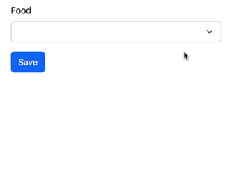
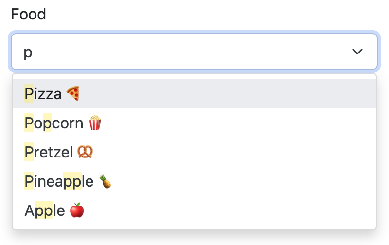

Autocomplete <select>
=====================

Transform your ``EntityType``, ``ChoiceType`` or *any* ``<select>`` element
into an Ajax-powered autocomplete smart UI control (leveraging `Tom Select`_):

**EXPERIMENTAL** This component is currently experimental and is likely
to change, or even change drastically.

Installation
------------

Before you start, make sure you have `Symfony UX configured in your app`_.

Then install the bundle using Composer and Symfony Flex:

.. code-block:: terminal

    $ composer require symfony/ux-autocomplete

    # Don't forget to install the JavaScript dependencies as well and compile
    $ npm install --force
    $ npm run watch

    # or use yarn
    $ yarn install --force
    $ yarn watch

Usage in a Form (without Ajax)
------------------------------

Any ``ChoiceType`` or ``EntityType`` can be transformed into a
Tom Select-powered UI control by adding the ``autocomplete`` option:

.. code-block:: diff

    // src/Form/AnyForm.php
    // ...

    class AnyForm extends AbstractType
    {
        public function buildForm(FormBuilderInterface $builder, array $options): void
        {
            $builder
                ->add('food', EntityType::class, [
                    'class' => Food::class,
                    'placeholder' => 'What should we eat?',
    +                'autocomplete' => true,
                ])

                ->add('portionSize', ChoiceType::class, [
                    'choices' => [
                        'Choose a portion size' => '',,
                        'small' => 's',
                        'medium' => 'm',
                        'large' => 'l',
                        'extra large' => 'xl',
                        'all you can eat' => '∞',
                    ],
    +                'autocomplete' => true,
                ])
            ;
        }
    }

That's all you need! When you refresh, the Autocomplete Stimulus controller
will transform your select element into a smart UI control:

Usage in a Form (with Ajax)
---------------------------

In the previous example, the autocomplete happens "locally":
all of the options are loaded onto the page and used for the
search.

If you're using an ``EntityType`` with *many* possible options,
a better option is to load the choices via AJAX. This also allows
you to search on more fields than just the "displayed" text.

To transform your field into an Ajax-powered autocomplete, you need
to create a new "form type" class to represent your field. If you
have MakerBundle installed, you can run:

.. code-block:: terminal

    $ php bin/console make:autocomplete-field

Or, create the field by hand::

    // src/Form/FoodAutocompleteField.php
    // ...

    use Symfony\Component\Security\Core\Security;
    use Symfony\UX\Autocomplete\Form\AsEntityAutocompleteField;
    use Symfony\UX\Autocomplete\Form\ParentEntityAutocompleteType;

    #[AsEntityAutocompleteField]
    class FoodAutocompleteField extends AbstractType
    {
        public function configureOptions(OptionsResolver $resolver)
        {
            $resolver->setDefaults([
                'class' => Food::class,
                'placeholder' => 'What should we eat?',

                // choose which fields to use in the search
                // if not passed, *all* fields are used
                //'searchable_fields' => ['name'],

                // if the autocomplete endpoint needs to be secured
                //'security' => 'ROLE_FOOD_ADMIN',

                // ... any other normal EntityType options
                // e.g. query_builder, choice_label
            ]);
        }

        public function getParent(): string
        {
            return ParentEntityAutocompleteType::class;
        }
    }

There are 3 important things:

#. The class needs the ``#[AsEntityAutocompleteField]`` attribute so that
   it's noticed by the autocomplete system.
#. The ``getParent()`` method must return ``ParentEntityAutocompleteType``.
#. Inside ``configureOptions()``, you can configure your field using whatever
   normal ``EntityType`` options you need plus a few extra options (see `Form Options Reference`_).

After creating this class, use it in your form:

.. code-block:: diff

    // src/Form/AnyForm.php
    // ...

    class AnyForm extends AbstractType
    {
        public function buildForm(FormBuilderInterface $builder, array $options): void
        {
            $builder
    +            ->add('food', FoodAutocompleteField::class)
            ;
        }
    }

For consistent results, avoid passing any options to the 3rd argument
of the ``->add()`` method. Instead, include all options inside the
custom class (``FoodAutocompleteField``).

Congratulations! Your ``EntityType`` is now Ajax-powered!

Styling Tom Select
------------------

In your ``assets/controllers.json`` file, you should see a line that automatically
includes a CSS file for Tom Select.

.. code-block:: text

    "autoimport": {
        "tom-select/dist/css/tom-select.default.css": true
    }

This should give you basic styles for Tom Select. If you're using
Bootstrap, you can get Bootstrap-ready styling by changing this
line to:

.. code-block:: text

    "autoimport": {
        "tom-select/dist/css/tom-select.bootstrap5.css": true
    }

To further customize things, you can override the classes with your own custom
CSS and even control how individual parts of Tom Select render. See `Tom Select Render Templates`_.

Form Options Reference
----------------------

All ``ChoiceType``, ``EntityType`` and ``TextType`` fields have the following new
options (these can also be used inside your custom Ajax autocomplete classes,
e.g. ``FoodAutocompleteField`` from above):

``autocomplete`` (default: ``false``)
    Set to ``true`` to activate the Stimulus plugin on your ``select`` element.

``tom_select_options`` (default: ``[]``)
    Use this to set custom `Tom Select Options`_. If you need to set
    an option using JavaScript, see `Extending Tom Select`_.

``options_as_html`` (default: ``false``)
    Set to ``true`` if your options (e.g. ``choice_label``) contain HTML. Not
    needed if your autocomplete is AJAX-powered.

``autocomplete_url`` (default: ``null``)
    Usually you don't need to set this manually. But, you *could* manually create
    an autocomplete-Ajax endpoint (e.g. for a custom ``ChoiceType``), then set this
    to change the field into an AJAX-powered select.

``no_results_found_text`` (default: 'No results found')
    Rendered when no matching results are found. This message is automatically translated
    using the ``AutocompleteBundle`` domain.

``no_more_results_text`` (default: 'No more results')
    Rendered at the bottom of the list after showing matching results. This message
    is automatically translated using the ``AutocompleteBundle`` domain.

For the Ajax-powered autocomplete field classes (i.e. those whose
``getParent()`` returns ``ParentEntityAutocompleteType``), in addition
to the options above, you can also pass:

``searchable_fields`` (default: ``null``)
    Set this to an array of the fields on your entity that should be used when
    searching for matching options. By default (i.e. ``null``), *all* fields on your
    entity will be searched. Relationship fields can also be used - e.g. ``category.name``
    if your entity has a ``category`` relation property.

``security`` (default: ``false``)
    Secures the Ajax endpoint. By default, the endpoint can be accessed by
    any user. To secure it, pass ``security`` to a string role (e.g. ``ROLE_FOOD_ADMIN``)
    that should be required to access the endpoint. Or, pass a callback and
    return ``true`` to grant access or ``false`` to deny access::

        use Symfony\Component\Security\Core\Security;

        'security' => function(Security $security): bool {
            return $security->isGranted('ROLE_FOO');
        }

Using with a TextType Field
---------------------------

All of the above options can also be used with a ``TextType`` field::

    $builder
        // ...
        ->add('tags', TextType::class, [
            'autocomplete' => true,
            'tom_select_options' => [
                'create' => true,
                'createOnBlur' => true,
                'delimiter' => ',',
            ],
            // 'autocomplete_url' => '... optional: custom endpoint, see below',
        ])
    ;

This ``<input>`` field won't have any autocomplete, but it *will* allow the
user to enter new options and see them as nice "items" in the box. On submit,
all of the options - separated by the ``delimiter`` - will be sent as a string.

You *can* add autocompletion to this via the ``autocomplete_url`` option - but you'll
likely need to create your own :ref:`custom autocomplete endpoint <custom-autocomplete-endpoint>`.

Extending Tom Select
--------------------

The easiest way to customize `Tom Select`_ is via the ``tom_select_options``
option that you pass to your field. This works great for simple
things like Tom Select's ``loadingClass`` option, which is set to a string.
But other options, like ``onInitialize``, must be set via JavaScript.

To do this, create a custom Stimulus controller and listen to one or both
events that the core Stimulus controller dispatches:

.. code-block:: javascript

    // assets/controllers/custom-autocomplete_controller.js
    import { Controller } from '@hotwired/stimulus';

    export default class extends Controller {
        initialize() {
            this._onPreConnect = this._onPreConnect.bind(this);
            this._onConnect = this._onConnect.bind(this);
        }

        connect() {
            this.element.addEventListener('autocomplete:pre-connect', this._onPreConnect);
            this.element.addEventListener('autocomplete:connect', this._onConnect);
        }

        disconnect() {
            // You should always remove listeners when the controller is disconnected to avoid side-effects
            this.element.removeEventListener('autocomplete:pre-connect', this._onConnect);
            this.element.removeEventListener('autocomplete:connect', this._onPreConnect);
        }

        _onPreConnect(event) {
            // TomSelect has not been initialized - options can be changed
            console.log(event.detail.options); // Options that will be used to initialize TomSelect
            event.detail.options.onChange = (value) => {
                // ...
            });
        }

        _onConnect(event) {
            // TomSelect has just been intialized and you can access details from the event
            console.log(event.detail.tomSelect); // TomSelect instance
            console.log(event.detail.options); // Options used to initialize TomSelect
        }
    }

Then, update your field configuration to use your new controller (it will be used
in addition to the core Autocomplete controller):

.. code-block:: diff

    $builder
        ->add('food', EntityType::class, [
            'class' => Food::class,
    +        'attr' => [
    +            'data-controller' => 'custom-autocomplete',
    +        ],
        ])

Or, if using a custom Ajax class, add the ``attr`` option to
your ``configureOptions()`` method:

.. code-block:: diff

    public function configureOptions(OptionsResolver $resolver)
    {
        $resolver->setDefaults([
            'class' => Food::class,
    +        'attr' => [
    +            'data-controller' => 'custom-autocomplete',
    +        ],
        ]);
    }

.. _custom-autocompleter:

Advanced: Creating an Autocompleter (with no Form)
--------------------------------------------------

If you're not using the form system, you can create an Ajax autocomplete
endpoint and then :ref:`initialize the Stimulus controller manually <manual-stimulus-controller>`.
This only works for Doctrine entities: see `Manually using the Stimulus Controller`_
if you're autocompleting something other than an entity.

To expose the endpoint, create a class that implements ``Symfony\\UX\\Autocomplete\\EntityAutocompleterInterface``::

    namespace App\Autocompleter;

    use App\Entity\Food;
    use Doctrine\ORM\EntityRepository;
    use Doctrine\ORM\QueryBuilder;
    use Symfony\Component\Security\Core\Security;
    use Symfony\UX\Autocomplete\EntityAutocompleterInterface;

    class FoodAutocompleter implements EntityAutocompleterInterface
    {
        public function getEntityClass(): string
        {
            return Food::class;
        }

        public function getQueryBuilder(EntityRepository $repository): QueryBuilder
        {
            return $repository
                // the alias "food" can be anything
                ->createQueryBuilder('food')
                // andWhere('food.isHealthy = :isHealthy')
                //->setParameter('isHealthy', true)
            ;
        }

        public function getLabel(object $entity): string
        {
            return $entity->getName();
        }

        public function getValue(object $entity): string
        {
            return $entity->getId();
        }

        public function getSearchableFields(): ?array
        {
            // see the "searchable_fields" option for details
            return null;
        }

        public function isGranted(Security $security): bool
        {
            // see the "security" option for details
            return true;
        }
    }

Next, tag this service with ``ux.entity_autocompleter`` and include an ``alias``:

.. code-block:: yaml

    # config/services.yaml
    services:
        # ...

        App\Autocompleter\FoodAutocompleter:
            tags:
                - { name: ux.entity_autocompleter, alias: 'food' }

Thanks to this, your can now autocomplete your ``Food`` entity via
the ``ux_entity_autocomplete`` route and ``alias`` route wildcard:

.. code-block:: twig

    {{ path('ux_entity_autocomplete', { alias: 'food' }) }}

Usually, you'll pass this URL to the Stimulus controller, which is
discussed in the next section.

.. _manual-stimulus-controller:

Manually using the Stimulus Controller
--------------------------------------

This library comes with a Stimulus controller that can activate
Tom Select on any ``select`` or ``input`` element. This can be used
outside of the Form component. For example:

.. code-block:: twig

    <select
        name="food"
        {{ stimulus_controller('symfony/ux-autocomplete/autocomplete')
    >

That's it! If you want the options to be autocompleted via
Ajax, pass a ``url`` value, which works well if you create
a :ref:`custom autocompleter <custom-autocompleter>`:

.. code-block:: twig

    <select
        name="food"
        {{ stimulus_controller('symfony/ux-autocomplete/autocomplete', {
            url: path('ux_entity_autocomplete', { alias: 'food' })
        })
    >

.. _custom-autocomplete-endpoint:

.. note::

    If you want to create an AJAX autocomplete endpoint that is
    *not* for an entity, you will need to create this manually.
    The only requirement is that the response returns JSON with this format:

    .. code-block:: json

        {
            "results": [
                { "value": "1", "text": "Pizza" },
                { "value": "2", "text":"Banana"}
            ]
        }

    Once you have this, generate the URL to your controller and
    pass it to the ``url`` value of the ``stimulus_controller()`` Twig
    function, or to the ``autocomplete_url`` option of your form field.

Beyond ``url``, the Stimulus controller has various other values,
including ``tomSelectOptions``. See the `controller.ts`_ file for
the full list.

Backward Compatibility promise
------------------------------

This bundle aims at following the same Backward Compatibility promise as
the Symfony framework: https://symfony.com/doc/current/contributing/code/bc.html

However it is currently considered `experimental`_, meaning it is not bound
to Symfony's BC policy for the moment.

.. _`Tom Select`: https://tom-select.js.org/
.. _`Symfony UX configured in your app`: https://symfony.com/doc/current/frontend/ux.html
.. _`Tom Select Options`: https://tom-select.js.org/docs/#general-configuration
.. _`controller.ts`: https://github.com/symfony/ux/blob/2.x/src/Autocomplete/assets/src/controller.ts
.. _`experimental`: https://symfony.com/doc/current/contributing/code/experimental.html
.. _`Tom Select Render Templates`: https://tom-select.js.org/docs/#render-templates
