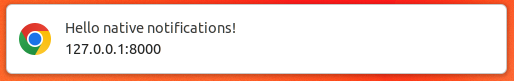

Symfony UX Notify
=================

Symfony UX Notify is a Symfony bundle integrating server-sent `native notifications`_
in Symfony applications using `Mercure`_. It is part of `the Symfony UX initiative`_.

Installation
------------

.. caution::

    Before you start, make sure you have `StimulusBundle configured in your app`_.

Install the bundle using Composer and Symfony Flex:

.. code-block:: terminal

    $ composer require symfony/ux-notify

If you're using WebpackEncore, install your assets and restart Encore (not
needed if you're using AssetMapper):

.. code-block:: terminal

    $ npm install --force
    $ npm run watch

Usage
-----

To use Symfony UX Notify you must have a `running Mercure server`_ and a
properly configured notifier transport:

.. code-block:: yaml

    # config/packages/notifier.yaml
    framework:
        notifier:
            chatter_transports:
               myMercureChatter: '%env(MERCURE_DSN)%'

Then, you can inject the ``NotifierInterface`` service and send messages on the ``chat/myMercureChatter`` channel::

    // ...
    use Symfony\Component\Notifier\ChatterInterface;
    use Symfony\Component\Notifier\Message\ChatMessage;

    #[AsCommand(name: 'app:flash-sales:announce')]
    class AnnounceFlashSalesCommand extends Command
    {
        public function __construct(private ChatterInterface $chatter)
        {
            parent::__construct();
        }

        protected function execute(InputInterface $input, OutputInterface $output): int
        {
            $message = (new ChatMessage(
                'Flash sales has been started!',
                new MercureOptions(['/chat/flash-sales'])
            ))->transport('myMercureChatter');

            $this->chatter->send($message);

            return 0;
        }
    }

The ``chat/flash-sales`` is the Mercure topic the message will be sent to.
The final step is to "listen" to that topic and trigger the notifications
in the user's browser. To do that, call the ``stream_notifications()`` Twig
function anywhere on the page:

.. code-block:: twig

    {{ stream_notifications(['/chat/flash-sales']) }}

.. note::

   Calling ``stream_notifications()`` without a parameter will default
   to the ``https://symfony.com/notifier`` topic.

Enjoy your server-sent native notifications!

Extend the Stimulus Controller
~~~~~~~~~~~~~~~~~~~~~~~~~~~~~~

Symfony UX Notify allows you to extend its default behavior using a
custom Stimulus controller:

.. code-block:: javascript

    // assets/controllers/mynotify_controller.js

    import { Controller } from '@hotwired/stimulus';

    export default class extends Controller {
        initialize() {
            // guarantees "this" refers to this object in _onConnect
            this._onConnect = this._onConnect.bind(this);
        }

        connect() {
            this.element.addEventListener('notify:connect', this._onConnect);
        }

        disconnect() {
            // You should always remove listeners when the controller is disconnected to avoid side effects
            this.element.removeEventListener('notify:connect', this._onConnect);
        }

        _onConnect(event) {
            // Event sources have just been created
            console.log(event.detail.eventSources);

            event.detail.eventSources.forEach((eventSource) => {
                eventSource.addEventListener('message', (event) => {
                    console.log(event); // You can add custom behavior on each event source
                });
            });
        }
    }

Then in your render call, add your controller as an HTML attribute:

.. code-block:: twig

    {{ stream_notifications(options = {'data-controller': 'mynotify'}) }}

Using another Mercure hub
~~~~~~~~~~~~~~~~~~~~~~~~~

Symfony UX Notify can be configured to specify the Mercure hub to use:

.. code-block:: yaml

    # config/packages/notify.yaml
    notify:
        # Specifies the Mercure hub to use. Defaults to "mercure.hub.default"
        mercure_hub: mercure.hub.custom

Backward Compatibility promise
------------------------------

This bundle aims at following the same Backward Compatibility promise as
the Symfony framework:
https://symfony.com/doc/current/contributing/code/bc.html

.. _`the Symfony UX initiative`: https://ux.symfony.com/
.. _StimulusBundle configured in your app: https://symfony.com/bundles/StimulusBundle/current/index.html
.. _`Mercure`: https://mercure.rocks
.. _`running Mercure server`: https://symfony.com/doc/current/mercure.html#running-a-mercure-hub
.. _`native notifications`: https://developer.mozilla.org/en-US/docs/Web/API/Notifications_API/Using_the_Notifications_API
