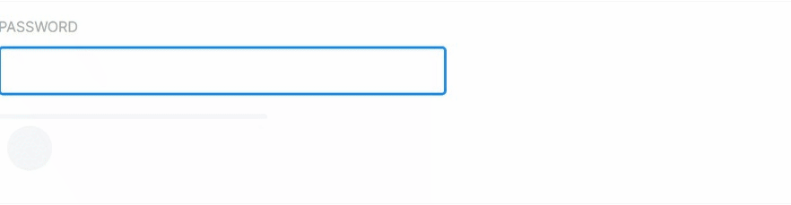

# Symfony UX Password Strength

Symfony UX Password Strength is a Symfony bundle integrating a password strength estimator in
Symfony applications. It is part of [the Symfony UX initiative](https://symfony.com/ux).

The password strength estimation method is the same as the default Symfony Constraint [`PasswordStrength`][1].

Example of password strength estimations
----------------------------------------

| Password                    | Strength | 
|-----------------------------| - |
| 123456                      | 🟥⬜️⬜️⬜️⬜️
| sm3llycat                   | 🟥🟥⬜️⬜️⬜️
| allBlacks #1                | 🟧🟧🟧⬜️⬜️
| D3LtaGamm@ !                | 🟧🟧🟧⬜️⬜️
| !LoveMyPiano*               | 🟩🟩🟩🟩⬜️
| Space Crocodi!0             | 🟩🟩🟩🟩⬜️
| SterlingGmail20.15          | 🟩🟩🟩🟩🟩
| Giant Funny Space Crocodile | 🟩🟩🟩🟩🟩

**This repository is a READ-ONLY sub-tree split**. See
https://github.com/symfony/ux to create issues or submit pull requests.

## Sponsor

The Symfony UX packages are [backed][2] by [Mercure.rocks][3].

Create real-time experiences in minutes! Mercure.rocks provides a realtime API service
that is tightly integrated with Symfony: create UIs that update in live with UX Turbo,
send notifications with the Notifier component, expose async APIs with API Platform and
create low level stuffs with the Mercure component. We maintain and scale the complex
infrastructure for you!

Help Symfony by [sponsoring][4] its development!

## Resources

-   [Documentation](https://symfony.com/bundles/ux-password-strength/current/index.html)
-   [Report issues](https://github.com/symfony/ux/issues) and
    [send Pull Requests](https://github.com/symfony/ux/pulls)
    in the [main Symfony UX repository](https://github.com/symfony/ux)

[1]: https://symfony.com/doc/current/reference/constraints/PasswordStrength.html
[2]: https://symfony.com/backers
[3]: https://mercure.rocks
[4]: https://symfony.com/sponsor
