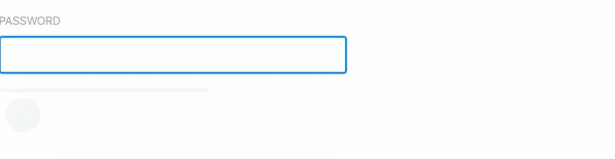

Symfony UX Password Strength
============================

Symfony UX Password Strength is a Symfony bundle integrating a password strength estimator
in Symfony applications. It is part of `the Symfony UX initiative`_.

The password strength estimation method is the same as the default Symfony Constraint `PasswordStrength`.

Installation
------------

Before you start, make sure you have `Symfony UX configured in your app`_.

Then install the bundle using Composer and Symfony Flex:

.. code-block:: terminal

    $ composer require symfony/ux-password-strength

    # Don't forget to install the JavaScript dependencies as well and compile
    $ npm install --force
    $ npm run watch

    # or use yarn
    $ yarn install --force
    $ yarn watch

Also make sure you have at least version 3.2.1 of
`@symfony/stimulus-bridge`_ in your ``package.json`` file.

Usage
-----

The component estimates the strength of a password and displays it as a number, a message or an attribute to a DOM element.
In the example below, the controller is applied to a form and the action ``estimatePasswordStrength`` is applied to the password field.
When typing the password, the result is sent to the targets. Note that you can have multiple targets of the same type.

* ``score``: the score of the password, between 0 and 4
* ``message``: a message describing the strength of the password
* ``meter``: an attribute to the element, with a value between 0 and 4

.. code-block:: html+twig

    <form {{ stimulus_controller('@symfony/ux-password-strength') }}>
        <label for="password">Password</label>
        <input id="password" name="password" type="password" {{ stimulus_action('@symfony/ux-password-strength', 'estimatePasswordStrength') }}>
        
The score is: 

        
The message is: 

        

        

    </form>

You can customize the messages displayed by the component by changing each message individually.
It is very useful if you want to translate the messages in your application.

.. code-block:: html+twig

    <form {{ stimulus_controller('@symfony/ux-password-strength', {
        veryWeakMessage: 'Very weak',
        weakMessage: 'Weak 🤔',
        mediumMessage: 'Not so bad 😅',
        strongMessage: 'Looks good 👌🏼',
        veryStrongMessage: 'Thank you for this amazing password! 🎊',
    }) }}>
        <!-- ... -->
    </form>

.. note::

Backward Compatibility promise
------------------------------

This bundle aims at following the same Backward Compatibility promise as
the Symfony framework:
https://symfony.com/doc/current/contributing/code/bc.html

.. _`the Symfony UX initiative`: https://symfony.com/ux
.. _`@symfony/stimulus-bridge`: https://github.com/symfony/stimulus-bridge
.. _`Symfony UX configured in your app`: https://symfony.com/doc/current/frontend/ux.html
