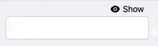

Symfony UX TogglePassword
=========================

Symfony UX TogglePassword is a Symfony bundle providing visibility toggle for password inputs
in Symfony Forms. It is part of `the Symfony UX initiative`_.

It allows visitors to switch the type of password field to text and vice versa.

Installation
------------

.. caution::

    Before you start, make sure you have `StimulusBundle configured in your app`_.

Install the bundle using Composer and Symfony Flex:

.. code-block:: terminal

    $ composer require symfony/ux-toggle-password

If you're using WebpackEncore, install your assets and restart Encore (not
needed if you're using AssetMapper):

.. code-block:: terminal

    $ npm install --force
    $ npm run watch

Usage with Symfony Forms
------------------------

Any ``PasswordType`` can be transformed into a toggle password field by adding the ``toggle`` option::

    // ...
    use Symfony\Component\Form\Extension\Core\Type\PasswordType;

    class CredentialFormType extends AbstractType
    {
        public function buildForm(FormBuilderInterface $builder, array $options)
        {
            $builder
                // ...
                ->add('password', PasswordType::class, ['toggle' => true])
                // ...
            ;
        }

        // ...
    }

A custom form theme is activated by default, wrapping the widget in ``
``.
You can disable it by passing ``use_toggle_form_theme`` option to ``false``::

    // ...
    use Symfony\Component\Form\Extension\Core\Type\PasswordType;

    class CredentialFormType extends AbstractType
    {
        public function buildForm(FormBuilderInterface $builder, array $options)
        {
            $builder
                // ...
                ->add('password', PasswordType::class, ['toggle' => true, 'use_toggle_form_theme' => false])
                // ...
            ;
        }

        // ...
    }

.. note::

   *Note*: If you choose to disable provided package form theme, you will have to handle styling by yourself.

.. _ux-password-customizing-labels-and-icons:

Customizing Labels and Icons
~~~~~~~~~~~~~~~~~~~~~~~~~~~~

The field uses the words "Show" and "Hide" by default and SVG icons from `Heroicons`_ for the toggle button.
You can customize them by passing ``hidden_label``, ``visible_label``, ``hidden_icon`` and ``visible_icon`` options
to the field (use ``null`` to disable label or icon)::

    // ...
    use Symfony\Component\Form\Extension\Core\Type\PasswordType;

    class CredentialFormType extends AbstractType
    {
        public function buildForm(FormBuilderInterface $builder, array $options)
        {
            $builder
                // ...
                ->add('password', PasswordType::class, [
                    'toggle' => true,
                    'hidden_label' => 'Masquer',
                    'visible_label' => 'Afficher',
                    'visible_icon' => null,
                    'hidden_icon' => null,
                ])
                // ...
            ;
        }

        // ...
    }

.. note::

   *Note*: Translation is supported for both label options.
   You can either use a translation key string (and provide a translation domain with the ``toggle_translation_domain`` option)
   or a ``Symfony\Component\Translation\TranslatableMessage`` object.
   Passing ``false`` to the ``toggle_translation_domain`` option will disable translation for the labels.

Customizing the Design
~~~~~~~~~~~~~~~~~~~~~~

The package provides a default stylesheet in order to ease
usage. You can disable it to add your own design if you wish.

In ``assets/controllers.json``, disable the default stylesheet by
switching the ``@symfony/ux-toggle-password/dist/style.min.css`` autoimport to
``false``:

.. code-block:: json

    {
        "controllers": {
            "@symfony/ux-toggle-password": {
                "toggle-password": {
                    "enabled": true,
                    "fetch": "eager",
                    "autoimport": {
                        "@symfony/ux-toggle-password/dist/style.min.css": false
                    }
                }
            }
        },
        "entrypoints": []
    }

.. note::

   *Note*: you should put the value to ``false`` and not remove the line
   so that Symfony Flex won't try to add the line again in the future.

Once done, the default stylesheet won't be used anymore and you can
implement your own CSS on top of the TogglePassword.

You can also only customize specific TogglePassword elements by overriding the default classes.
Add your custom class name(s) using the ``button_classes`` option for the toggle element.
A ``toggle_container_classes`` option is also available to customize the container form theme element::

    // ...
    use Symfony\Component\Form\Extension\Core\Type\PasswordType;

    class CredentialFormType extends AbstractType
    {
        public function buildForm(FormBuilderInterface $builder, array $options)
        {
            $builder
                // ...
                ->add('password', PasswordType::class, [
                    'toggle' => true,
                    'button_classes' => ['btn', 'primary', 'my-custom-class'],
                    'toggle_container_classes' => ['input-group-text', 'my-custom-container'],
                ])
                // ...
            ;
        }

        // ...
    }

Extend the Default Behavior
~~~~~~~~~~~~~~~~~~~~~~~~~~~

If you need additional control from JavaScript, you can leverage a few events dispatched by this package:

.. code-block:: javascript

    // assets/controllers/my-toggle-password_controller.js

    import { Controller } from '@hotwired/stimulus';

    export default class extends Controller {
        connect() {
            this.element.addEventListener('toggle-password:connect', this._onConnect);
            this.element.addEventListener('toggle-password:show', this._onShow);
            this.element.addEventListener('toggle-password:hide', this._onHide);
        }

        disconnect() {
            // You should always remove listeners when the controller is disconnected to avoid side-effects
            this.element.removeEventListener('toggle-password:connect', this._onConnect);
            this.element.removeEventListener('toggle-password:show', this._onShow);
            this.element.removeEventListener('toggle-password:hide', this._onHide);
        }

        _onConnect(event) {
            // The TogglePassword was just created.
            // You can for example add custom attributes to the toggle element
            const toggle = event.detail.button;
            toggle.dataset.customProperty = 'my-custom-value';

            // Or add a custom class to the input element
            const input = event.detail.element;
            input.classList.add('my-custom-class');
        }

        _onShow(event) {
            // The TogglePassword input has just been toggled for text type.
            // You can for example add custom attributes to the toggle element
            const toggle = event.detail.button;
            toggle.dataset.visible = true;

            // Or add a custom class to the input element
            const input = event.detail.element;
            input.classList.add('my-custom-class');
        }

        _onHide(event) {
            // The TogglePassword input has just been toggled for password type.
            // You can for example update custom attributes to the toggle element
            const toggle = event.detail.button;
            delete toggle.dataset.visible;

            // Or remove a custom class to the input element
            const input = event.detail.element;
            input.classList.remove('my-custom-class');
        }
    }

Then in your form, add your controller as an HTML attribute::

    // ...
    use Symfony\Component\Form\Extension\Core\Type\PasswordType;

    class CredentialFormType extends AbstractType
    {
        public function buildForm(FormBuilderInterface $builder, array $options)
        {
            $builder
                // ...
                ->add('password', PasswordType::class, [
                    'toggle' => true,
                    'attr' => ['data-controller' => 'my-toggle-password'],
                ])
                // ...
            ;
        }

        // ...
    }

Usage without Symfony Forms
---------------------------

You can also use the TogglePassword with native HTML inputs. Inside the ``stimulus_controller()``
function you can use the same :ref:`options to customize labels and icons <ux-password-customizing-labels-and-icons>`
shown in previous sections:

.. code-block:: html+twig

    {# ... #}

    {# add "toggle-password-container" or a class that applies "position: relative" to this container #}
    

        <label for="password">Password</label>
        <input
            id="password"
            name="password"
            type="password"
            {{ stimulus_controller('symfony/ux-toggle-password/toggle-password', {
                visibleLabel: 'Show password',
                visibleIcon: 'Name of some SVG icon',
                hiddenLabel: 'Hide password',
                hiddenIcon: 'Name of some SVG icon',
                # you can add your own CSS classes if needed, but the following
                # CSS class is required to activate the default styles
                buttonClasses: ['toggle-password-button'],
            }) }}
        >
    

    {# ... #}

Backward Compatibility promise
------------------------------

This bundle aims at following the same Backward Compatibility promise as
the Symfony framework:
https://symfony.com/doc/current/contributing/code/bc.html

.. _`the Symfony UX initiative`: https://ux.symfony.com/
.. _StimulusBundle configured in your app: https://symfony.com/bundles/StimulusBundle/current/index.html
.. _Heroicons: https://heroicons.com/
