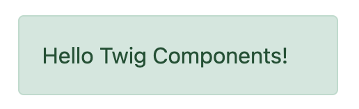

Twig Components
===============

Twig components give you the power to bind an object to a template,
making it easier to render and re-use small template "units" - like an
"alert", markup for a modal, or a category sidebar:

Every component consists of (1) a class::

    // src/Twig/Components/Alert.php
    namespace App\Twig\Components;

    use Symfony\UX\TwigComponent\Attribute\AsTwigComponent;

    #[AsTwigComponent]
    class Alert
    {
        public string $type = 'success';
        public string $message;
    }

And (2) a template:

.. code-block:: html+twig

    {# templates/components/Alert.html.twig #}
    

        {{ message }}
    

Done! Now render it wherever you want:

.. code-block:: html+twig

    {{ component('Alert', { message: 'Hello Twig Components!' }) }}

    <twig:Alert message="Or use the fun HTML syntax!" />

Enjoy your new component!

   Example of the Alert Component

This brings the familiar "component" system from client-side frameworks
into Symfony. Combine this with `Live Components`_, to create
an interactive frontend with automatic, Ajax-powered rendering.

Want a demo? Check out https://ux.symfony.com/twig-component#demo

Installation
------------

Let's get this thing installed! Run:

.. code-block:: terminal

    $ composer require symfony/ux-twig-component

That's it! We're ready to go! If you're not using Symfony Flex, add a config
file to control the template directory for your components:

.. _default_config:

.. code-block:: yaml

    # config/packages/twig_component.yaml
    twig_component:
        anonymous_template_directory: 'components/'
        defaults:
            # Namespace & directory for components
            App\Twig\Components\: 'components/'

Component Basics
----------------

Let's create a reusable "alert" element that we can use to show success
or error messages across our site. Step 1 is to create a component class
and give it the ``AsTwigComponent`` attribute::

    // src/Twig/Components/Alert.php
    namespace App\Twig\Components;

    use Symfony\UX\TwigComponent\Attribute\AsTwigComponent;

    #[AsTwigComponent]
    class Alert
    {
    }

This class can technically live anywhere, but in practice, you'll put it
somewhere under the namespace configured in :ref:`config/packages/twig_component.yaml <default_config>`.
This helps TwigComponent :ref:`name <naming>` your component and know where its
template lives.

Step 2 is to create the template. By default, templates
live in ``templates/components/{component_name}.html.twig``, where
``{component_name}`` matches the class name of the component:

.. code-block:: html+twig

    {# templates/components/Alert.html.twig #}
    

        Success! You've created a Twig component!
    

This isn't very interesting yet… since the message is hardcoded in the
template. But it's enough! Celebrate by rendering your component from
any other Twig template:

.. code-block:: twig

    {{ component('Alert') }}

Done! You've just rendered your first Twig Component! You can see it
and any other components by running:

.. code-block:: terminal

    $ php bin/console debug:twig-component

Take a moment to fist pump - then come back!

.. _naming:

Naming Your Component
~~~~~~~~~~~~~~~~~~~~~

.. versionadded:: 2.8

    Before 2.8, passing a name to ``AsTwigComponent`` was required. Now, the
    name is optional and defaults to the class name.

To give your component a name, TwigComponent looks at the namespace(s)
configured in :ref:`twig_component.yaml <default_config>` and finds the
first match. If your have the recommended ``App\Twig\Components\``, then:

========================================  ===================
Component Class                            Component Name
========================================  ===================
``App\Twig\Components\Alert``              ``Alert``
``App\Twig\Components\Button\Primary``     ``Button:Primary``
========================================  ===================

The ``:`` character is used in the name instead of ``\``. See
:ref:`Configuration <configuration>` for more info.

Instead of letting TwigComponent choose a name, you can also set one yourself::

    #[AsTwigComponent('alert')]
    class Alert
    {
    }

Passing Data (Props) into your Component
~~~~~~~~~~~~~~~~~~~~~~~~~~~~~~~~~~~~~~~~

To make our ``Alert`` component reusable, we need the message and type
(e.g. ``success``, ``danger``, etc) to be configurable. To do that, create a
public property for each:

.. code-block:: diff

      // src/Twig/Components/Alert.php
      // ...

      #[AsTwigComponent]
      class Alert
      {
    +     public string $message;

    +     public string $type = 'success';

          // ...
      }

In the template, the ``Alert`` instance is available via
the ``this`` variable and public properties are available directly.
Use them to render the two new properties:

.. code-block:: html+twig

    

        {{ message }}

        {# Same as above, but using "this", which is the component object #}
        {{ this.message }}
    

How can we populate the ``message`` and ``type`` properties? By passing
them as "props" via the a 2nd argument to ``component()``:

.. code-block:: twig

    {{ component('Alert', { message: 'Successfully created!' }) }}

    {{ component('Alert', {
        type: 'danger',
        message: 'Danger Will Robinson!'
    }) }}

Behind the scenes, a new ``Alert`` will be instantiated and the
``message`` key (and ``type`` if passed) will be set onto the
``$message`` property of the object. Then, the component is rendered! If
a property has a setter method (e.g. ``setMessage()``), that will be
called instead of setting the property directly.

.. note::

    You can disable exposing public properties for a component. When disabled,
    ``this.property`` must be used::

        #[AsTwigComponent(exposePublicProps: false)]
        class Alert
        {
            // ...
        }

Passing & Rendering Attributes
~~~~~~~~~~~~~~~~~~~~~~~~~~~~~~

If you pass extra props that are *not* settable on your component class,
those can be rendered as attributes:

.. code-block:: twig

    {{ component('Alert', {
        id: 'custom-alert-id',
        message: 'Danger Will Robinson!'
    }) }}

To render the attributes, use the special ``attributes`` variable that's
available in every component template:

.. code-block:: html+twig

    

        {{ message }}
    

See :ref:`Component Attributes <attributes>` to learn more.

Component Template Path
~~~~~~~~~~~~~~~~~~~~~~~

If you're using the :ref:`default config <default_config>`, the template
name will be: ``templates/components/{component_name}.html.twig``, where
``{component_name}`` matches the component *name*.

===================  ==================================================
Component Name       Template Path
===================  ==================================================
``Alert``            ``templates/components/Alert.html.twig``
``Button:Primary``   ``templates/components/Button/Primary.html.twig``
===================  ==================================================

Any ``:`` in the name are changed to subdirectories.

You can control the template used via the ``AsTwigComponent`` attribute:

.. code-block:: diff

      // src/Twig/Components/Alert.php
      // ...

    - #[AsTwigComponent]
    + #[AsTwigComponent(template: 'my/custom/template.html.twig')]
      class Alert

You can also configure the default template directory for an entire
namespace. See :ref:`Configuration <configuration>`.

Component HTML Syntax
~~~~~~~~~~~~~~~~~~~~~

So far so good! To make it *really* nice to work with Twig Components, it
comes with an HTML-like syntax where props are passed as attributes:

.. code-block:: html+twig

    <twig:Alert message="This is really cool!" withCloseButton />

This would pass a ``message`` and ``withCloseButton`` (``true``) props
to the ``Alert`` component and render it! If an attribute is dynamic,
prefix the attribute with ``:`` or use the normal ``{{ }}`` syntax:

.. code-block:: html+twig

    <twig:Alert message="hello!" :user="user.id" />

    // equal to
    <twig:Alert message="hello!" user="{{ user.id }}" />

    // pass object, array, or anything you imagine
    <twig:Alert :foo="{col: ['foo', 'oof']}" />

Boolean props require using the dynamic syntax:

.. code-block:: html+twig

    {# in this example, the 'false' value is passed as a string
       (so it's converted automatically to the true boolean value) #}
    <twig:Alert message="..." withCloseButton="false" />

    {# in the following examples, the 'false' value is passed as a boolean property #}
    <twig:Alert message="..." :withCloseButton="false" />
    <twig:Alert message="..." withCloseButton="{{ false }}" />

Don't forget that you can mix and match props with attributes that you
want to render on the root element:

.. code-block:: html+twig

    <twig:Alert message="hello!" id="custom-alert-id" />

To pass an array of attributes, use ``{{...}}`` spread operator syntax.
This requires Twig 3.7.0 or higher:

.. code-block:: html+twig

    <twig:Alert{{ ...myAttributes }} />

We'll use the HTML syntax for the rest of the guide.

Passing HTML to Components
~~~~~~~~~~~~~~~~~~~~~~~~~~

Instead of passing a ``message`` prop to the ``Alert`` component, what if we
could do this?

.. code-block:: html+twig

    <twig:Alert>
        I'm writing <strong>HTML</strong> right here!
    </twig:Alert>

We can! When you add content between the ``<twig:Alert>`` open and
close tag, it's passed to your component template as the block called
``content``. You can render it like any normal block:

.. code-block:: html+twig

    

        
    

You can even give the block default content. See
:ref:`Passing HTML to Components via Block <embedded-components>`
for more info.

Fetching Services
-----------------

Let's create a more complex example: a "featured products" component.
You *could* choose to pass an array of Product objects to the component
and set those on a ``$products`` property. But instead, let's let the
*component* to do the work of executing the query.

How? Components are *services*, which means autowiring works like
normal. This example assumes you have a ``Product`` Doctrine entity and
``ProductRepository``::

    // src/Twig/Components/FeaturedProducts.php
    namespace App\Twig\Components;

    use App\Repository\ProductRepository;
    use Symfony\UX\TwigComponent\Attribute\AsTwigComponent;

    #[AsTwigComponent]
    class FeaturedProducts
    {
        private ProductRepository $productRepository;

        public function __construct(ProductRepository $productRepository)
        {
            $this->productRepository = $productRepository;
        }

        public function getProducts(): array
        {
            // an example method that returns an array of Products
            return $this->productRepository->findFeatured();
        }
    }

In the template, the ``getProducts()`` method can be accessed via
``this.products``:

.. code-block:: html+twig

    {# templates/components/FeaturedProducts.html.twig #}
    

        <h3>Featured Products</h3>

        
            ...
        
    

And because this component doesn't have any public properties that we
need to populate, you can render it with:

.. code-block:: html+twig

    <twig:FeaturedProducts />

.. note::

    Because components are services, normal dependency injection can be used.
    However, each component service is registered with ``shared: false``. That
    means that you can safely render the same component multiple times with
    different data because each component will be an independent instance.

Mounting Data
-------------

Most of the time, you will create public properties and then pass values
to those as "props" when rendering. But there are several hooks in case
you need to do something more complex.

The mount() Method
~~~~~~~~~~~~~~~~~~

For more control over how your "props" are handled, you can create a method
called ``mount()``::

    // src/Twig/Components/Alert.php
    // ...

    #[AsTwigComponent]
    class Alert
    {
        public string $message;
        public string $type = 'success';

        public function mount(bool $isSuccess = true)
        {
            $this->type = $isSuccess ? 'success' : 'danger';
        }

        // ...
    }

The ``mount()`` method is called just one time: immediately after your
component is instantiated. Because the method has an ``$isSuccess``
argument, if we pass an ``isSuccess`` prop when rendering, it will be
passed to ``mount()``.

.. code-block:: html+twig

    <twig:Alert
        :isSuccess="false"
        message="Danger Will Robinson!"
    />

If a prop name (e.g. ``isSuccess``) matches an argument name in ``mount()``,
the prop will be passed as that argument and the component system will
**not** try to set it directly on a property or use it for the component
``attributes``.

PreMount Hook
~~~~~~~~~~~~~

If you need to modify/validate data before it's *mounted* on the
component use a ``PreMount`` hook::

    // src/Twig/Components/Alert.php
    use Symfony\UX\TwigComponent\Attribute\PreMount;
    // ...

    #[AsTwigComponent]
    class Alert
    {
        public string $message;
        public string $type = 'success';

        #[PreMount]
        public function preMount(array $data): array
        {
            // validate data
            $resolver = new OptionsResolver();
            $resolver->setIgnoreUndefined(true);

            $resolver->setDefaults(['type' => 'success']);
            $resolver->setAllowedValues('type', ['success', 'danger']);
            $resolver->setRequired('message');
            $resolver->setAllowedTypes('message', 'string');

            return $resolver->resolve($data) + $data;
        }

        // ...
    }

.. note::

    In its default configuration, the OptionsResolver treats all props.
    However, if more props are passed than the options defined in the OptionsResolver,
    an error will be prompted, indicating that one or more options do not exist.
    To avoid this, use the ``ignoreUndefined()`` method with ``true``.
    See `ignore not defined options`_ for more info::
   
        $resolver->setIgnoreUndefined(true);
   
    The major drawback of this configuration is that the OptionsResolver will
    remove every non-defined option when resolving data. To maintain props that
    have not been defined within the OptionsResolver, combine the data from the
    hook with the resolved data::
   
        return $resolver->resolve($data) + $data;

The data returned from ``preMount()`` will be used as the props for mounting.

.. note::

    If your component has multiple ``PreMount`` hooks, and you'd like to control
    the order in which they're called, use the ``priority`` attribute parameter:
    ``PreMount(priority: 10)`` (higher called earlier).

PostMount Hook
~~~~~~~~~~~~~~

.. versionadded:: 2.1

    The ``PostMount`` hook was added in TwigComponents 2.1.

After a component is instantiated and its data mounted, you can run extra
code via the ``PostMount`` hook::

    // src/Twig/Components/Alert.php
    use Symfony\UX\TwigComponent\Attribute\PostMount;
    // ...

    #[AsTwigComponent]
    class Alert
    {
        #[PostMount]
        public function postMount(): void
        {
            if (str_contains($this->message, 'danger')) {
                $this->type = 'danger';
            }
        }
        // ...
    }

A ``PostMount`` method can also receive an array ``$data`` argument, which
will contain any props passed to the component that have *not* yet been processed,
(i.e. they don't correspond to any property and weren't an argument to the
``mount()`` method). You can handle these props, remove them from the ``$data``
and return the array::

    // src/Twig/Components/Alert.php
    #[AsTwigComponent]
    class Alert
    {
        public string $message;
        public string $type = 'success';

        #[PostMount]
        public function processAutoChooseType(array $data): array
        {
            if ($data['autoChooseType'] ?? false) {
                if (str_contains($this->message, 'danger')) {
                    $this->type = 'danger';
                }

                // remove the autoChooseType prop from the data array
                unset($data['autoChooseType']);
            }

            // any remaining data will become attributes on the component
            return $data;
        }
        // ...
    }

.. note::

    If your component has multiple ``PostMount`` hooks, and you'd like to control
    the order in which they're called, use the ``priority`` attribute parameter:
    ``PostMount(priority: 10)`` (higher called earlier).

Anonymous Components
--------------------

Sometimes a component is simple enough that it doesn't need a PHP class.
In this case, you can skip the class and only create the template. The component
name is determined by the location of the template:

.. code-block:: html+twig

    {# templates/components/Button/Primary.html.twig #}
    <button {{ attributes.defaults({ class: 'primary' }) }}>
        
    </button>

The name for this component will be ``Button:Primary`` because of
the subdirectory:

.. code-block:: html+twig

    {# index.html.twig #}
    ...
    

       <twig:Button:Primary>Click Me!</twig:Button:Primary>
    

    {# renders as: #}
    <button class="primary">Click Me!</button>

Like normal, you can pass extra attributes that will be rendered on the element:

.. code-block:: html+twig

    {# index.html.twig #}
    ...
    

       <twig:Button:Primary type="button" name="foo">Click Me!</twig:Button:Primary>
    

    {# renders as: #}
    <button class="primary" type="button" name="foo">Click Me!</button>

You can also pass a variable (prop) into your template:

.. code-block:: html+twig

    {# index.html.twig #}
    ...
    

        <twig:Button icon="fa-plus" type="primary" role="button">Click Me!</twig:Button>
    

To tell the system that ``icon`` and ``type`` are props and not attributes, use the
```` tag at the top of your template.

.. code-block:: html+twig

    {# templates/components/Button.html.twig #}
    

    <button {{ attributes.defaults({ class: 'btn btn-'~type }) }}>
        
        
            
        
    </button>

.. _embedded-components:

Passing HTML to Components Via Blocks
-------------------------------------

Props aren't the only way you can pass something to your component. You can
also pass content:

.. code-block:: html+twig

    <twig:Alert type="success">
        
Congratulations! You've won a free puppy!

    </twig:Alert>

In your component template, this becomes a block named ``content``:

.. code-block:: html+twig

    

        
            // the content will appear in here
        
     

You can also add more, named blocks:

.. code-block:: html+twig

    <twig:Alert type="success">
        
Congrats on winning a free puppy!

        <twig:block name="footer">
            {{ parent() }} {# render the default content if needed #}
            <button class="btn btn-primary">Claim your prize</button>
        </twig:block>
    </twig:Alert>

Render these in the normal way.

.. code-block:: html+twig

    

        
        
            
Default Footer content

        
     

Passing content into your template can also be done with LiveComponents
though there are some caveats to know related to variable scope.
See `Passing Blocks to Live Components`_.

There is also a non-HTML syntax that can be used:

.. code-block:: html+twig

    
        
Congrats!

        ... footer content
    

Context / Variables Inside of Blocks
~~~~~~~~~~~~~~~~~~~~~~~~~~~~~~~~~~~~

The content inside of the ``<twig:{Component}>`` should be viewed as living in its own,
independent template, which extends the component's template. This has a few interesting
consequences.

First, inside of ``<twig:{Component}>``, the ``this`` variable represents
the component you're *now* rendering *and* you have access to all of *that*
component's variables:

.. code-block:: html+twig

    {# templates/components/SuccessAlert.html.twig #}
    {{ this.someFunction }} {# this === SuccessAlert #}

    <twig:Alert type="success">
        {{ this.someFunction }} {# this === Alert #}

        {{ type }} {# references a "type" prop from Alert #}
    </twig:Alert>

Conveniently, in addition to the variables from the ``Alert`` component, you
*also* have access to whatever variables are available in the original template:

.. code-block:: html+twig

    {# templates/components/SuccessAlert.html.twig #}
    
    <twig:Alert type="success">
        Hello {{ name }}
    </twig:Alert>

ALL variables from the upper component (e.g. ``SuccessAlert``) are available
inside the content of the lower component (e.g. ``Alert``). However, because variables
are merged, any variables with the same name are overridden by the lower component
(e.g. ``Alert``). That's why ``this`` refers to the embedded, or "current" component
``Alert``.

There is also one special superpower when passing content to a component: your
code executes as if it is "copy-and-pasted" into the block of the target template.
This means you can **access variables from the block you're overriding**! For example:

.. code-block:: twig

    {# templates/component/SuccessAlert.html.twig #}
    
        
            A default {{ message }}
        
    

When overriding the ``alert_message`` block, you have access to the ``message`` variable:

.. code-block:: html+twig

    {# templates/some_page.html.twig #}
    <twig:SuccessAlert>
        <twig:block name="alert_message">
            I can override the alert_message block and access the {{ message }} too!
        </twig:block>
    </twig:SuccessAlert>

.. versionadded:: 2.13

    The ability to refer to the scope of higher components via the ``outerScope`` variable was added in 2.13.

As mentioned before, variables from lower components are merged with those from upper components. When you need
access to some properties or functions from higher components, that can be done via the ``outerScope...`` variable:

.. code-block:: twig

    {# templates/SuccessAlert.html.twig #}
    
    
    
        Hello {{ name }} {# Hello Bart #}

        {{ message }} {{ outerScope.name }} {# Hello Fabien #}

        {{ outerScope.this.someFunction }} {# this refers to SuccessAlert #}

        {{ outerScope.this.someProp }} {# references a "someProp" prop from SuccessAlert #}
    

You can keep referring to components higher up as well. Just add another ``outerScope``.
Remember though that the ``outerScope`` reference only starts once you're INSIDE the (embedded) component.

.. code-block:: twig

    {# templates/FancyProfileCard.html.twig #}
    
        
             {# not yet INSIDE the Alert template #}
                
                    {{ message }} {# same value as below, indirectly refers to FancyProfileCard::someProp #}
                    {{ outerScope.outerScope.this.someProp }} {# directly refers to FancyProfileCard::someProp #}
                
            
        
    

Inheritance & Forwarding "Outer Blocks"
~~~~~~~~~~~~~~~~~~~~~~~~~~~~~~~~~~~~~~~

.. versionadded:: 2.10

    The ``outerBlocks`` variable was added in 2.10.

The content inside a ``<twig:{Component}>`` tag should be viewed as living in
its own, independent template, which *extends* the component's template. This means that
any blocks that live in the "outer" template are not available. However, you
*can* access these via a special ``outerBlocks`` variable:

.. code-block:: html+twig

  

  <strong>Attention! Free Puppies!</strong>

  
    <twig:Alert>
        {# block('call_to_action') #} would not work #}

        {{ block(outerBlocks.call_to_action) }}
    </twig:Alert>
  

The ``outerBlocks`` variable becomes especially useful with nested components.
For example, imagine we want to create a ``SuccessAlert`` component:

.. code-block:: html+twig

    {# templates/some_page.html.twig #}
    <twig:SuccessAlert>
        We will successfully <em>forward</em> this block content!
    <twig:SuccessAlert>

We already have a generic ``Alert`` component, so let's re-use it:

.. code-block:: html+twig

    {# templates/components/Alert.html.twig #}
    

        
    

To do this, the ``SuccessAlert`` component can grab the ``content`` block
that's passed to it via the ``outerBlocks`` variable and forward it into ``Alert``:

.. code-block:: html+twig

    {# templates/components/SuccessAlert.html.twig #}
    <twig:Alert type="success">
    
        {{ block(outerBlocks.content) }}
    </twig:Alert>

By passing the original ``content`` block into the ``content`` block of ``Alert``,
this will work perfectly.

.. _attributes:

Component Attributes
--------------------

A common need for components is to configure/render attributes for the
root node. Attributes are any props that are passed when rendering that
cannot be mounted on the component itself. This extra data is added to a
``ComponentAttributes`` object that's available as ``attributes`` in your
component's template:

.. code-block:: html+twig

    {# templates/components/MyComponent.html.twig #}
    <div{{ attributes }}>
      My Component!
    

When rendering the component, you can pass an array of html attributes to add:

.. code-block:: html+twig

    <twig:MyComponent class="foo" style="color: red" />

    {# renders as: #}
    

      My Component!
    

Set an attribute's value to ``true`` to render just the attribute name:

.. code-block:: html+twig

    {# templates/components/Input.html.twig #}
    <input{{ attributes }}/>

    {# render component #}
    <twig:Input type="text" value="" :autofocus="true" />

    {# renders as: #}
    <input type="text" value="" autofocus/>

Set an attribute's value to ``false`` to exclude the attribute:

.. code-block:: html+twig

    {# templates/components/Input.html.twig #}
    <input{{ attributes }}/>

    {# render component #}
    <twig:Input type="text" value="" :autofocus="false" />

    {# renders as: #}
    <input type="text" value=""/>

To add a custom `Stimulus controller`_ to your root component element:

.. code-block:: html+twig

    

.. versionadded:: 2.9

    The ability to use ``stimulus_controller()`` with ``attributes.defaults()``
    was added in TwigComponents 2.9 and requires ``symfony/stimulus-bundle``.
    Previously, ``stimulus_controller()`` was passed to an ``attributes.add()``
    method.

.. note::

    You can adjust the attributes variable exposed in your template::

        #[AsTwigComponent(attributesVar: '_attributes')]
        class Alert
        {
            // ...
        }

Defaults & Merging
~~~~~~~~~~~~~~~~~~

In your component template, you can set defaults that are merged with
passed attributes. The passed attributes override the default with
the exception of *class*. For ``class``, the defaults are prepended:

.. code-block:: html+twig

    {# templates/components/MyComponent.html.twig #}
    <button{{ attributes.defaults({ class: 'bar', type: 'button' }) }}>Save</button>

    {# render component #}
    {{ component('MyComponent', { style: 'color:red' }) }}

    {# renders as: #}
    <button class="bar" type="button" style="color:red">Save</button>

    {# render component #}
    {{ component('MyComponent', { class: 'foo', type: 'submit' }) }}

    {# renders as: #}
    <button class="bar foo" type="submit">Save</button>

Render
~~~~~~

.. versionadded:: 2.15

    The ability to *render* attributes was added in TwigComponents 2.15.

You can take full control over the attributes that are rendered by using the
``render()`` method.

.. code-block:: html+twig

    {# templates/components/MyComponent.html.twig #}
    

      My Component!
    

    {# render component #}
    {{ component('MyComponent', { style: 'color:red;' }) }}

    {# renders as: #}
    

      My Component!
    

.. caution::

    There are a few important things to know about using ``render()``:

    #. You need to be sure to call your ``render()`` methods before calling ``{{ attributes }}`` or some
       attributes could be rendered twice. For instance:

       .. code-block:: html+twig

           {# templates/components/MyComponent.html.twig #}
           

               My Component!
           

           {# render component #}
           {{ component('MyComponent', { style: 'color:red;' }) }}

           {# renders as: #}
           
 {# style is rendered twice! #}
               My Component!
           

    #. If you add an attribute without calling ``render()``, it will be rendered twice. For instance:

       .. code-block:: html+twig

           {# templates/components/MyComponent.html.twig #}
           

               My Component!
           

           {# render component #}
           {{ component('MyComponent', { style: 'color:red;' }) }}

           {# renders as: #}
           
 {# style is rendered twice! #}
               My Component!
           

Only
~~~~

Extract specific attributes and discard the rest:

.. code-block:: html+twig

    {# render component #}
    {{ component('MyComponent', { class: 'foo', style: 'color:red' }) }}

    {# templates/components/MyComponent.html.twig #}
    <div{{ attributes.only('class') }}>
      My Component!
    

    {# renders as: #}
    

      My Component!
    

Without
~~~~~~~

Exclude specific attributes:

.. code-block:: html+twig

    {# render component #}
    {{ component('MyComponent', { class: 'foo', style: 'color:red' }) }}

    {# templates/components/MyComponent.html.twig #}
    <div{{ attributes.without('class') }}>
      My Component!
    

    {# renders as: #}
    

      My Component!
    

Nested Attributes
~~~~~~~~~~~~~~~~~

.. versionadded:: 2.17

    The Nested Attributes feature was added in TwigComponents 2.17.

You can have attributes that aren't meant to be used on the *root* element
but one of its *descendants*. This is useful for, say, a dialog component where
you want to allow customizing the attributes of the dialog's content, title,
and footer. Here's an example of this:

.. code-block:: html+twig

    {# templates/components/Dialog.html.twig #}
    <div{{ attributes }}>
        <div{{ attributes.nested('title') }}>
            Default Title
        

        <div{{ attributes.nested('body') }}>
            
        

        <div{{ attributes.nested('footer') }}>
            Default Footer
        

    

    {# render #}
    <twig:Dialog class="foo" title:class="bar" body:class="baz" footer:class="qux">
        Some content
    </twig:MyDialog>

    {# output #}
    

        

            Default Title
        

        

            Some content
        

        

            Default Footer
        

    

The nesting is recursive so you could potentially do something like this:

.. code-block:: html+twig

    <twig:Form
        :form="form"
        class="ui-form"
        row:class="ui-form-row"
        row:label:class="ui-form-label"
        row:widget:class="ui-form-widget"
    />

Component with Complex Variants (CVA)
-------------------------------------

.. versionadded:: 2.16

    The ``cva`` function was added in TwigComponents 2.16.

`CVA (Class Variant Authority)`_ is a concept from the JavaScript world and used
by the well-known `shadcn/ui`_.
CVA allows you to display a component with different variants (color, size, etc.),
to create highly reusable and customizable components. This is powered by a ``cva()`` Twig
function where you define ``base`` classes that should always be present and then different
``variants`` and the corresponding classes:

.. code-block:: html+twig

    {# templates/components/Alert.html.twig #}
    

     

    

         
    

Then use the ``color`` and ``size`` variants to select the classes needed:

.. code-block:: html+twig

    {# index.html.twig #}
    <twig:Alert color="red" size="lg">
        
My content

    </twig:Alert>
    // class="alert bg-red text-lg"

    <twig:Alert color="green" size="sm">
        
My content

    </twig:Alert>
    // class="alert bg-green text-sm"

    <twig:Alert color="red" class="flex items-center justify-center">
        
My content

    </twig:Alert>
    // class="alert bg-red text-md flex items-center justify-center"

CVA and Tailwind CSS
~~~~~~~~~~~~~~~~~~~~

CVA work perfectly with Tailwind CSS. The only drawback is that you can have class conflicts.
To "merge" conflicting classes together and keep only the ones you need, use the
``tailwind_merge()`` method from `tales-from-a-dev/twig-tailwind-extra`_
with the ``cva()`` function:

.. code-block:: terminal

    $ composer require tales-from-a-dev/twig-tailwind-extra

.. code-block:: html+twig

    {# templates/components/Alert.html.twig #}
    

   

    

         
    

Compound Variants
~~~~~~~~~~~~~~~~~

You can define compound variants. A compound variant is a variant that applies
when multiple other variant conditions are met.

.. code-block:: html+twig

    {# templates/components/Alert.html.twig #}
    

    {% set alert = cva({
        base: 'alert ',
        variants: {
            color: {
                blue: 'bg-blue',
                red: 'bg-red',
                green: 'bg-green',
            },
            size: {
                sm: 'text-sm',
                md: 'text-md',
                lg: 'text-lg',
            }
        },
        compoundVariants: [{
            // if color = red AND size = (md or lg), add the `font-bold` class
            color: ['red'],
            size: ['md', 'lg'],
            class: 'font-bold'
        }]
    }) %}

    

         
    

    {# index.html.twig #}

    <twig:Alert color="red" size="lg">
        
My content

    </twig:Alert>
    // class="alert bg-red text-lg font-bold"

    <twig:Alert color="green" size="sm">
        
My content

    </twig:Alert>
    // class="alert bg-green text-sm"

    <twig:Alert color="red" size="md">
        
My content

    </twig:Alert>
    // class="alert bg-green text-lg font-bold"

Default Variants
~~~~~~~~~~~~~~~~

If no variants match, you can define a default set of classes to apply:

.. code-block:: html+twig

    {# templates/components/Alert.html.twig #}
    

    {% set alert = cva({
        base: 'alert ',
        variants: {
            color: {
                blue: 'bg-blue',
                red: 'bg-red',
                green: 'bg-green',
            },
            size: {
                sm: 'text-sm',
                md: 'text-md',
                lg: 'text-lg',
            },
            rounded: {
                sm: 'rounded-sm',
                md: 'rounded-md',
                lg: 'rounded-lg',
            }
        },
        defaultVariants: {
            rounded: 'md',
        }
    }) %}

    

         
    

    {# index.html.twig #}

    <twig:Alert color="red" size="lg">
        
My content

    </twig:Alert>
    // class="alert bg-red text-lg font-bold rounded-md"

Test Helpers
------------

You can test how your component is mounted and rendered using the
``InteractsWithTwigComponents`` trait::

    use Symfony\Bundle\FrameworkBundle\Test\KernelTestCase;
    use Symfony\UX\TwigComponent\Test\InteractsWithTwigComponents;

    class MyComponentTest extends KernelTestCase
    {
        use InteractsWithTwigComponents;

        public function testComponentMount(): void
        {
            $component = $this->mountTwigComponent(
                name: 'MyComponent', // can also use FQCN (MyComponent::class)
                data: ['foo' => 'bar'],
            );

            $this->assertInstanceOf(MyComponent::class, $component);
            $this->assertSame('bar', $component->foo);
        }

        public function testComponentRenders(): void
        {
            $rendered = $this->renderTwigComponent(
                name: 'MyComponent', // can also use FQCN (MyComponent::class)
                data: ['foo' => 'bar'],
            );

            $this->assertStringContainsString('bar', $rendered);

            // use the crawler
            $this->assertCount(5, $rendered->crawler()->filter('ul li'));
        }

        public function testEmbeddedComponentRenders(): void
        {
            $rendered = $this->renderTwigComponent(
                name: 'MyComponent', // can also use FQCN (MyComponent::class)
                data: ['foo' => 'bar'],
                content: '
My content
', // "content" (default) block
                blocks: [
                    'header' => '
My header
',
                    'menu' => $this->renderTwigComponent('Menu'), // can embed other components
                ],
            );

            $this->assertStringContainsString('bar', $rendered);
        }
    }

.. note::

    The ``InteractsWithTwigComponents`` trait can only be used in tests that extend
    ``Symfony\Bundle\FrameworkBundle\Test\KernelTestCase``.

Special Component Variables
---------------------------

By default, your template will have access to the following variables:

* ``this``
* ``attributes``
* ... and all public properties on your component

There are also a few other special ways you can control the variables.

ExposeInTemplate Attribute
~~~~~~~~~~~~~~~~~~~~~~~~~~

All public component properties are available directly in your component
template. You can use the ``ExposeInTemplate`` attribute to expose
private/protected properties and public methods directly in a component
template (``someProp`` vs ``this.someProp``, ``someMethod`` vs ``this.someMethod``).
Properties must be *accessible* (have a getter). Methods *cannot have*
required parameters::

    // ...
    use Symfony\UX\TwigComponent\Attribute\ExposeInTemplate;

    #[AsTwigComponent]
    class Alert
    {
        #[ExposeInTemplate]
        private string $message; // available as `{{ message }}` in the template

        #[ExposeInTemplate('alert_type')]
        private string $type = 'success'; // available as `{{ alert_type }}` in the template

        #[ExposeInTemplate(name: 'ico', getter: 'fetchIcon')]
        private string $icon = 'ico-warning'; // available as `{{ ico }}` in the template using `fetchIcon()` as the getter

        /**
         * Required to access $this->message
         */
        public function getMessage(): string
        {
            return $this->message;
        }

        /**
         * Required to access $this->type
         */
        public function getType(): string
        {
            return $this->type;
        }

        /**
         * Required to access $this->icon
         */
        public function fetchIcon(): string
        {
            return $this->icon;
        }

        #[ExposeInTemplate]
        public function getActions(): array // available as `{{ actions }}` in the template
        {
            // ...
        }

        #[ExposeInTemplate('dismissable')]
        public function canBeDismissed(): bool // available as `{{ dismissable }}` in the template
        {
            // ...
        }

        // ...
    }

.. note::

    When using ``ExposeInTemplate`` on a method the value is fetched eagerly
    before rendering.

Computed Properties
~~~~~~~~~~~~~~~~~~~

In the previous example, instead of querying for the featured products
immediately (e.g. in ``__construct()``), we created a ``getProducts()``
method and called that from the template via ``this.products``.

This was done because, as a general rule, you should make your
components as *lazy* as possible and store only the information you need
on its properties (this also helps if you convert your component to a
`live component`_ later). With this setup, the query is only executed if and
when the ``getProducts()`` method is actually called. This is very similar
to the idea of "computed properties" in frameworks like `Vue`_.

But there's no magic with the ``getProducts()`` method: if you call
``this.products`` multiple times in your template, the query would be
executed multiple times.

To make your ``getProducts()`` method act like a true computed property,
call ``computed.products`` in your template. ``computed`` is a proxy
that wraps your component and caches the return of methods. If they
are called additional times, the cached value is used.

.. code-block:: html+twig

    {# templates/components/FeaturedProducts.html.twig #}
    

        <h3>Featured Products</h3>

        
            ...
        

        ...
         {# use cache, does not result in a second query #}
            ...
        
    

.. note::

    Computed methods only work for component methods with no required
    arguments.

Events
------

Twig Components dispatches various events throughout the lifecycle
of instantiating, mounting and rendering a component.

PreRenderEvent
~~~~~~~~~~~~~~

Subscribing to the ``PreRenderEvent`` gives the ability to modify
the twig template and twig variables before components are rendered::

    use Symfony\Component\EventDispatcher\EventSubscriberInterface;
    use Symfony\UX\TwigComponent\Event\PreRenderEvent;

    class HookIntoTwigPreRenderSubscriber implements EventSubscriberInterface
    {
        public function onPreRender(PreRenderEvent $event): void
        {
            $event->getComponent(); // the component object
            $event->getTemplate(); // the twig template name that will be rendered
            $event->getVariables(); // the variables that will be available in the template

            $event->setTemplate('some_other_template.html.twig'); // change the template used

            // manipulate the variables:
            $variables = $event->getVariables();
            $variables['custom'] = 'value';

            $event->setVariables($variables); // {{ custom }} will be available in your template
        }

        public static function getSubscribedEvents(): array
        {
            return [PreRenderEvent::class => 'onPreRender'];
        }
    }

PostRenderEvent
~~~~~~~~~~~~~~~

.. versionadded:: 2.5

    The ``PostRenderEvent`` was added in TwigComponents 2.5.

The ``PostRenderEvent`` is called after a component has finished
rendering and contains the ``MountedComponent`` that was just
rendered.

PreCreateForRenderEvent
~~~~~~~~~~~~~~~~~~~~~~~

.. versionadded:: 2.5

    The ``PreCreateForRenderEvent`` was added in TwigComponents 2.5.

Subscribing to the ``PreCreateForRenderEvent`` gives the ability to be
notified before a component object is created or hydrated, at the
very start of the rendering process. You have access to the component
name, input props and can interrupt the process by setting HTML. This
event is not triggered during a re-render.

PreMountEvent and PostMountEvent
~~~~~~~~~~~~~~~~~~~~~~~~~~~~~~~~

To run code just before or after a component's data is mounted, you can
listen to ``PreMountEvent`` or ``PostMountEvent``.

Nested Components
-----------------

It's totally possible to nest one component into another. When you do
this, there's nothing special to know: both components render
independently. If you're using `Live Components`_, then there
*are* some guidelines related to how the re-rendering of parent and
child components works. Read `Live Nested Components`_.

Configuration
-------------

To see the full list of configuration options, run:

.. code-block:: terminal

    $ php bin/console config:dump twig_component

The most important configuration is the ``defaults`` key, which allows
you to define options for different namespaces of your components. This
controls how components are named and where their templates live:

.. code-block:: yaml

    # config/packages/twig_component.yaml
    twig_component:
        defaults:
            # short form: components under this namespace:
            #    - name will be the class name that comes after the prefix
            #        App\Twig\Components\Alert => Alert
            #        App\Twig\Components\Button\Primary => Button:Primary
            #    - templates will live in "components/"
            #        Alert => templates/components/Alert.html.twig
            #        Button:Primary => templates/components/Button/Primary.html.twig
            App\Twig\Components\: components/

            # long form
            App\Pizza\Components\:
                template_directory: components/pizza
                # component names will have an extra "Pizza:" prefix
                #    App\Pizza\Components\Alert => Pizza:Alert
                #    App\Pizza\Components\Button\Primary => Pizza:Button:Primary
                name_prefix: Pizza

If a component class matches multiple namespaces, the first matched will
be used.

3rd-Party Bundle
~~~~~~~~~~~~~~~~

The flexibility of Twig Components is extended even further when integrated
with third-party bundles, allowing developers to seamlessly include pre-built
components into their projects.

Anonymous Components
--------------------

.. versionadded:: 2.20

    The bundle convention for Anonymous components was added in TwigComponents 2.18.

Using a component from a third-party bundle is just as straightforward as using
one from your own application. Once the bundle is installed and configured, you
can reference its components directly within your Twig templates:

.. code-block:: html+twig

    <twig:Shadcn:Button type="primary">
        Click me
    </twig:Shadcn:Button>

Here, the component name is composed of the bundle's Twig namespace ``Shadcn``, followed
by a colon, and then the component path Button.

.. note::

    You can discover the Twig namespace of every registered bundle by inspecting the
    ``bin/console debug:twig`` command.

The component must be located in the bundle's ``templates/components/`` directory. For
example, the component referenced as ``<twig:Shadcn:Button>`` should have its template
file at ``templates/components/Button.html.twig`` within the Shadcn bundle.

Debugging Components
--------------------

As your application grows, you'll eventually have a lot of components.
This command will help you to debug some components issues.
First, the debug:twig-component command lists all your application components
that live in ``templates/components/``:

.. code-block:: terminal

    $ php bin/console debug:twig-component

    +---------------+-----------------------------+------------------------------------+------+
    | Component     | Class                       | Template                           | Type |
    +---------------+-----------------------------+------------------------------------+------+
    | Coucou        | App\Components\Alert        | components/Coucou.html.twig        |      |
    | RandomNumber  | App\Components\RandomNumber | components/RandomNumber.html.twig  | Live |
    | Test          | App\Components\foo\Test     | components/foo/Test.html.twig      |      |
    | Button        |                             | components/Button.html.twig        | Anon |
    | foo:Anonymous |                             | components/foo/Anonymous.html.twig | Anon |
    | Acme:Button   |                             | @Acme/components/Button.html.twig  | Anon |
    +---------------+-----------------------------+------------------------------------+------+

Pass the name of some component as an argument to print its details:

.. code-block:: terminal

    $ php bin/console debug:twig-component RandomNumber

    +---------------------------------------------------+-----------------------------------+
    | Property                                          | Value                             |
    +---------------------------------------------------+-----------------------------------+
    | Component                                         | RandomNumber                      |
    | Class                                             | App\Components\RandomNumber       |
    | Template                                          | components/RandomNumber.html.twig |
    | Type                                              | Live                              |
    +---------------------------------------------------+-----------------------------------+
    | Properties (type / name / default value if exist) | string $name = toto               |
    |                                                   | string $type = test               |
    | Live Properties                                   | int $max = 1000                   |
    |                                                   | int $min = 10                     |
    +---------------------------------------------------+-----------------------------------+

Contributing
------------

Interested in contributing? Visit the main source for this repository:
https://github.com/symfony/ux/tree/main/src/TwigComponent.

Backward Compatibility promise
------------------------------

This bundle aims at following the same Backward Compatibility promise as
the Symfony framework:
https://symfony.com/doc/current/contributing/code/bc.html

.. _`Live Components`: https://symfony.com/bundles/ux-live-component/current/index.html
.. _`live component`: https://symfony.com/bundles/ux-live-component/current/index.html
.. _`Vue`: https://v3.vuejs.org/guide/computed.html
.. _`Live Nested Components`: https://symfony.com/bundles/ux-live-component/current/index.html#nested-components
.. _`Passing Blocks to Live Components`: https://symfony.com/bundles/ux-live-component/current/index.html#passing-blocks
.. _`Stimulus controller`: https://symfony.com/bundles/StimulusBundle/current/index.html
.. _`CVA (Class Variant Authority)`: https://cva.style/docs/getting-started/variants
.. _`shadcn/ui`: https://ui.shadcn.com
.. _`tales-from-a-dev/twig-tailwind-extra`: https://github.com/tales-from-a-dev/twig-tailwind-extra
.. _`ignore not defined options`: https://symfony.com/doc/current/components/options_resolver.html#ignore-not-defined-options
