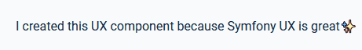

# Symfony UX Typed

Symfony UX Typed is a Symfony bundle integrating [Typed](https://github.com/mattboldt/typed.js/blob/master/README.md) in
Symfony applications. It is part of [the Symfony UX initiative](https://symfony.com/ux).

Typed is a complete and easy to use animated typed texts.
Just enter the strings you want to see typed, and it goes live without complexity.



## Installation

Symfony UX Typed does not use any PHP and can be installed with any PHP/Symfony version.

You can install this bundle using Composer and Symfony Flex:

```sh
composer require symfony/ux-typed

# Don't forget to install the JavaScript dependencies as well and compile
yarn install --force
yarn encore dev
```

Also make sure you have at least version 2.0 of [@symfony/stimulus-bridge](https://github.com/symfony/stimulus-bridge)
in your `package.json` file.

## Usage

Typed works using a list of strings and will manage typing them on your page.
It comes with a lot of parameters to customize the way the strings are typed: speed, cursor, delays
and smart backspace are some incredible parameters you can use.

The main usage of Symfony UX Typed is to use its Stimulus controller to initialize Typed:

```twig
<div>
    I created this UX component because
    <span {{ stimulus_controller('symfony/ux-typed/typed', {
        strings: ['I ❤ Symfony UX', 'Symfony UX is great', 'Symfony UX is easy']
    }) }}></span>
</div>
```

**Note** The `stimulus_controller()` function comes from
[WebpackEncoreBundle v1.10](https://github.com/symfony/webpack-encore-bundle).

That's it! Typed now shows the messages defined in the list passed as argument.
You can customize the way those messages are typed.
Parameters are exactly the same as for the [typed library](https://github.com/mattboldt/typed.js/blob/master/README.md)

```twig
<div>
    I created this UX component because
    <span {{ stimulus_controller('symfony/ux-typed/typed', {
        strings: ['I ❤ Symfony UX', 'Symfony UX is great', 'Symfony UX is easy'],
        smartBackspace: true,
        startDelay: 100,
        backSpeed: 20,
        backDelay: 100,
        loop: true,
        showCursor: true,
        cursorChar: '✨'
    }) }}></span>
</div>
```

## Backward Compatibility promise

This bundle aims at following the same Backward Compatibility promise as the Symfony framework:
[https://symfony.com/doc/current/contributing/code/bc.html](https://symfony.com/doc/current/contributing/code/bc.html)

However it is currently considered
[**experimental**](https://symfony.com/doc/current/contributing/code/experimental.html),
meaning it is not bound to Symfony's BC policy for the moment.

## Run tests

### JavaScript tests

```sh
cd Resources/assets
yarn test
```
