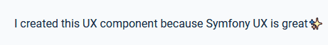

# Symfony UX Typed

> [!WARNING]
> **Deprecated**: This package has been **deprecated** in 2.x and will be removed in the next major version.

To keep the same functionality in your Symfony application, follow these migration steps:

1. Install the `typed.js` library:

```bash
# If using Symfony AssetMapper:
php bin/console importmap:require typed.js

# If using NPM (e.g.: with Webpack Encore):
npm install typed.js
```

2. Add the following code to your app:

<details><summary><code>assets/controllers/typed_controller.js</code></summary>

```javascript
import { Controller } from '@hotwired/stimulus';
import Typed from 'typed.js';

export default class extends Controller {
    static values = {
        strings: Array,
        typeSpeed: { type: Number, default: 30 },
        smartBackspace: { type: Boolean, default: true },
        startDelay: Number,
        backSpeed: Number,
        shuffle: Boolean,
        backDelay: { type: Number, default: 700 },
        fadeOut: Boolean,
        fadeOutClass: { type: String, default: 'typed-fade-out' },
        fadeOutDelay: { type: Number, default: 500 },
        loop: Boolean,
        loopCount: { type: Number, default: Number.POSITIVE_INFINITY },
        showCursor: { type: Boolean, default: true },
        cursorChar: { type: String, default: '.' },
        autoInsertCss: { type: Boolean, default: true },
        attr: String,
        bindInputFocusEvents: Boolean,
        contentType: { type: String, default: 'html' },
    };

    connect() {
        const options = {
            strings: this.stringsValue,
            typeSpeed: this.typeSpeedValue,
            smartBackspace: this.smartBackspaceValue,
            startDelay: this.startDelayValue,
            backSpeed: this.backSpeedValue,
            shuffle: this.shuffleValue,
            backDelay: this.backDelayValue,
            fadeOut: this.fadeOutValue,
            fadeOutClass: this.fadeOutClassValue,
            fadeOutDelay: this.fadeOutDelayValue,
            loop: this.loopValue,
            loopCount: this.loopCountValue,
            showCursor: this.showCursorValue,
            cursorChar: this.cursorCharValue,
            autoInsertCss: this.autoInsertCssValue,
            attr: this.attrValue,
            bindInputFocusEvents: this.bindInputFocusEventsValue,
            contentType: this.contentTypeValue,
        };

        this.dispatchEvent('pre-connect', { options });
        const typed = new Typed(this.element, options);
        this.dispatchEvent('connect', { typed, options });
    }

    dispatchEvent(name, payload) {
        this.dispatch(name, { detail: payload, prefix: 'typed' });
    }
}
```

</details>

3. Replace the `symfony--ux-typed` occurrences in your templates with `typed`, for example:

```diff

<span
-    data-controller="symfony--ux-typed"
-    data-symfony--ux-typed-loop-value="true"
-    data-symfony--ux-typed-show-cursor-value="true"
-    data-symfony--ux-typed-cursor-char-value="✨"
-    data-symfony--ux-typed-strings-value="{{ strings|json_encode|e('html_attr') }}"
+    data-controller="typed"
+    data-typed-loop-value="true"
+    data-typed-show-cursor-value="true"
+    data-typed-cursor-char-value="✨"
+    data-typed-strings-value="{{ strings|json_encode|e('html_attr') }}"
></span>
```

4. Remove `symfony/ux-typed` from your dependencies:

```bash
composer remove symfony/ux-typed
```

You're done!

---

Symfony UX Typed is a Symfony bundle integrating [Typed](https://github.com/mattboldt/typed.js/blob/master/README.md) in
Symfony applications. It is part of [the Symfony UX initiative](https://ux.symfony.com/).

Typed is a complete and easy to use animated typed texts.
Just enter the strings you want to see typed, and it goes live without complexity.



**This repository is a READ-ONLY sub-tree split**. See
https://github.com/symfony/ux to create issues or submit pull requests.

## Sponsor

The Symfony UX packages are [backed][1] by [Mercure.rocks][2].

Create real-time experiences in minutes! Mercure.rocks provides a realtime API service
that is tightly integrated with Symfony: create UIs that update in live with UX Turbo,
send notifications with the Notifier component, expose async APIs with API Platform and
create low level stuffs with the Mercure component. We maintain and scale the complex
infrastructure for you!

Help Symfony by [sponsoring][3] its development!

## Resources

-   [Documentation](https://symfony.com/bundles/ux-typed/current/index.html)
-   [Report issues](https://github.com/symfony/ux/issues) and
    [send Pull Requests](https://github.com/symfony/ux/pulls)
    in the [main Symfony UX repository](https://github.com/symfony/ux)

[1]: https://symfony.com/backers
[2]: https://mercure.rocks
[3]: https://symfony.com/sponsor
