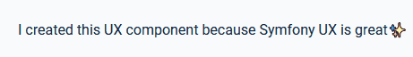

Symfony UX Typed
================

Symfony UX Typed is a Symfony bundle integrating `Typed`_ in
Symfony applications. It is part of `the Symfony UX initiative`_.

Typed is a complete and easy to use animated typed texts.
Just enter the strings you want to see typed, and it goes live without complexity.

Installation
------------

.. caution::

    Before you start, make sure you have `StimulusBundle configured in your app`_.

Install the bundle using Composer and Symfony Flex:

.. code-block:: terminal

    $ composer require symfony/ux-typed

If you're using WebpackEncore, install your assets and restart Encore (not
needed if you're using AssetMapper):

.. code-block:: terminal

    $ npm install --force
    $ npm run watch

Usage
-----

Typed works using a list of strings and will manage typing them on your page.
It comes with a lot of parameters to customize the way the strings are typed: speed, cursor, delays
and smart backspace are some incredible parameters you can use.

The main usage of Symfony UX Typed is to use its Stimulus controller to initialize Typed:

.. code-block:: html+twig

    

        I created this UX component because
        
    

That's it! Typed now shows the messages defined in the ``strings`` argument.
You can customize the way those messages are typed.
Parameters are exactly the same as for the `typed library`_

.. code-block:: html+twig

    

        I created this UX component because
        
    

Extend the JavaScript Controller
~~~~~~~~~~~~~~~~~~~~~~~~~~~~~~~~

Symfony UX Typed allows you to extend its default behavior using a custom
Stimulus controller:

.. code-block:: javascript

    // assets/controllers/mytyped_controller.js

    import { Controller } from '@hotwired/stimulus';

    export default class extends Controller {
        initialize() {
            this._onPreConnect = this._onPreConnect.bind(this);
            this._onConnect = this._onConnect.bind(this);
        }

        connect() {
            this.element.addEventListener('typed:pre-connect', this._onPreConnect);
            this.element.addEventListener('typed:connect', this._onConnect);
        }

        disconnect() {
            // You should always remove listeners when the controller is disconnected to avoid side-effects
            this.element.removeEventListener('typed:connect', this._onConnect);
            this.element.removeEventListener('typed:pre-connect', this._onPreConnect);
        }

        _onPreConnect(event) {
            // Typed has not been initialized - options can be changed
            console.log(event.detail.options); // Options that will be used to initialize Typed
            event.detail.options.onBegin = (typed) => {
                console.log("Typed is ready to type cool messages!");
            };
            event.detail.options.onStop = (typed) => {
                console.log("OK. Enough is enough.");
            };
        }

        _onConnect(event) {
            // Typed has just been intialized and you can access details from the event
            console.log(event.detail.typed); // Typed instance
            console.log(event.detail.options); // Options used to initialize Typed
        }
    }

.. code-block::

Then in your template, add your controller to the HTML attribute:

.. code-block:: html+twig

    <html lang="en">
        <head>
            <title>Typed</title>
            {# ... #}
        </head>
        <body {{ stimulus_controller('mytyped')|stimulus_controller('symfony/ux-typed', {
            strings: ['...'],
        }) }}>
            {# ... #}
        </body>
    </html>

.. note::

   Be careful to add your controller **before** the Typed controller so that it
   is executed before and can listen on the ``typed:connect`` event properly.

Backward Compatibility promise
------------------------------

This bundle aims at following the same Backward Compatibility promise as
the Symfony framework:
https://symfony.com/doc/current/contributing/code/bc.html

.. _`Typed`: https://github.com/mattboldt/typed.js/blob/master/README.md
.. _`the Symfony UX initiative`: https://ux.symfony.com/
.. _`typed library`: https://github.com/mattboldt/typed.js/blob/master/README.md
.. _StimulusBundle configured in your app: https://symfony.com/bundles/StimulusBundle/current/index.html
